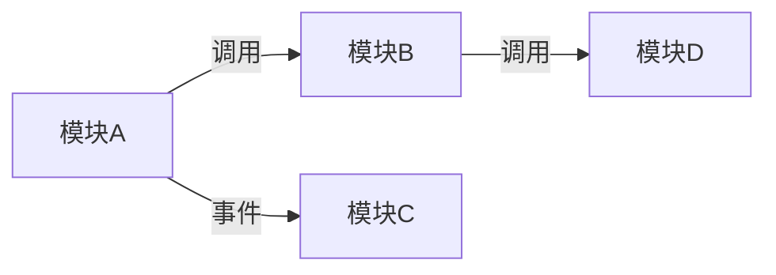

# 模块清单

> 本项目按业务领域划分为以下模块。两级索引：模块 → 每模块的链路文档。

---

## 完整知识树

### {模块A} — {一句话职责}

→ [mod-{A}.md](mod-{A}.md)

- flow: [flow-{流程1}](../03-chains/{A}/flow-{流程1}.md) · {一句话说明}
- lifecycle: [lifecycle-{实体}](../03-chains/{A}/lifecycle-{实体}.md) · {一句话说明}
- dataflow: [dataflow-{场景}](../03-chains/{A}/dataflow-{场景}.md) · {一句话说明}

### {模块B} — {一句话职责}

→ [mod-{B}.md](mod-{B}.md)

- flow: [flow-{流程2}](../03-chains/{B}/flow-{流程2}.md) · {一句话说明}
- interaction: [interaction-{协作}](../03-chains/{B}/interaction-{协作}.md) · {一句话说明}
- （暂无更多链路文档）

---

## 模块依赖图

---

## 按场景查找

| 场景 | 相关模块 |
|------|----------|
| {场景1} | [{模块A}](mod-{A}.md) |
| {场景2} | [{模块B}](mod-{B}.md) |

---

## 导航

- ↑ 上级: [系统总览](../01-system/00-index.md)
- → 各模块: 见上方完整知识树
