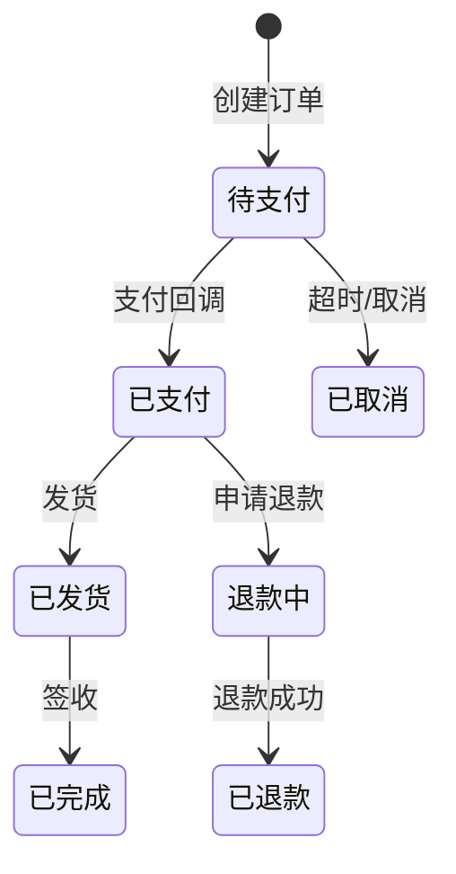
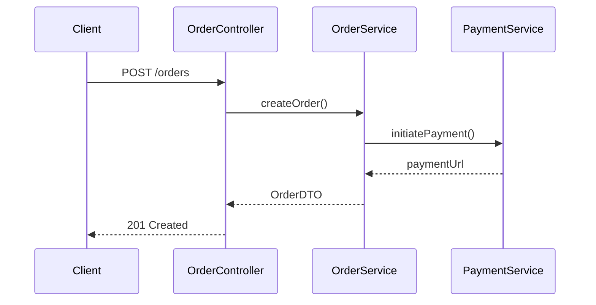
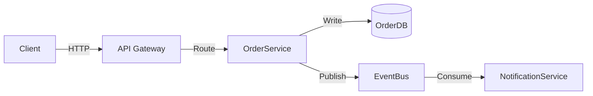

# Agent Memory Skill - Reference

详细的文档编写规范和格式要求。由 [SKILL.md](SKILL.md) 引用，写模式时按需查阅。

---

## 1. 证据锚点格式

每条能力记录必须附带以下格式之一的证据锚点：

| 类型 | 格式示例 |
|------|----------|
| 类 | `OrderService` (`src/service/OrderService.java`) |
| 方法 | `OrderService.createOrder()` |
| 路由 | `POST /api/v1/orders` |
| 配置 | `application.yml:order.max-items` |
| 数据库 | `t_order` 表 |
| 消息 | `ORDER_CREATED` Topic |

---

## 2. 文档通用格式

每个文档应遵循以下结构：

```markdown
# 文档标题

> 一句话定位/摘要

## 1. 章节名

### 1.1 子章节

- **关键词**: 值（证据锚点）
- **关键词**: 值（证据锚点）

## N. 可检索关键词

`关键词1` / `关键词2` / `ClassName` / `/api/path` / `table_name`

## N+1. 导航

- ↑ 上级: [系统总览](../01-system/00-index.md)
- → 相关: [模块-XX](mod-xx.md)
- ↓ 链路: [链路文档](../03-chains/xx/)
- ↓↓ 深度: [深度文档](../04-deep/xx/)
```

**索引文件（00-index.md）的特殊格式**：

`00-index.md` 不使用普通导航 footer，而是使用「完整知识树」节展示两级视图（见第 9 节）。普通文档保持 ↑↓→ footer 不变。

---

## 3. 正反示例

**❌ Bad** — 无锚点、模糊：
```markdown
## 已实现能力

- 实现了订单管理功能
- 支持多种支付方式
- 有完善的错误处理
```

**✅ Good** — 有锚点、具体：
```markdown
## 已实现能力

- **订单创建**: `OrderService.create()` (`src/service/OrderService.java:45`)
  - 商品校验: `ProductValidator.validate()`
  - 库存扣减: `InventoryService.deduct()`

- **支付集成**: `PaymentController` (`src/controller/PaymentController.java`)
  - 支付宝: `POST /api/payment/alipay`
  - 微信: `POST /api/payment/wechat`

- **错误码体系**: `ErrorCode` 枚举 (`src/constant/ErrorCode.java`)
  - `ORDER_NOT_FOUND` (1001)
  - `PAYMENT_FAILED` (2001)
```

---

## 4. Mermaid 图表规范

链路层（03-chains）使用 Mermaid 图表达复杂逻辑，优先于纯文字描述。

### 状态机图 (生命周期)



### 序列图 (模块交互)



### 数据流图



---

## 5. 写入判断表（代码事实验证）

写入记忆前，必须对每个证据锚点进行代码事实验证：

| 验证维度 | 方法 | 通过条件 | 不通过则 |
|----------|------|----------|----------|
| **存在性** | Grep 搜索类名/方法名 | 代码中确实存在该符号 | 不写入该锚点 |
| **完整性** | Read 查看方法体 | 非空实现，无 TODO/FIXME/HACK | 不写入或标注为部分实现 |
| **可用性** | Grep 搜索调用方 | 有实际调用链，非死代码 | 不写入 |
| **排除检查** | Read 查看注解/标记 | 无 @Deprecated、非 mock、非注释代码 | 不写入 |

### 场景判断

| 场景 | 是否写入 | 原因 |
|------|----------|------|
| 方法体是空实现/TODO | ❌ | 未开发完毕 |
| 有 @Deprecated 标记 | ❌ | 即将废弃 |
| 仅在测试中被调用 (mock) | ❌ | 非生产代码 |
| feature flag 关闭状态 | ❌ | 功能未启用 |
| 代码被注释掉 | ❌ | 非活跃代码 |
| **方法实现完整 + 有调用链** | **✅** | 经验证的事实 |
| 紧急回滚/删除后 | ✅ | 需同步回退文档 |

---

## 6. 记忆文档定位

| 用途 | 正确位置 | 错误位置 |
|------|----------|----------|
| 开发中的需求 | 需求文档/TODO/Comments | ❌ `.agent-memory/` |
| 技术方案讨论 | RFC/设计文档/PR描述 | ❌ `.agent-memory/` |
| 经代码验证的实现 | ✅ `.agent-memory/` | — |
| 历史变更记录 | Git历史/CHANGELOG | ❌ `.agent-memory/` |

---

## 7. 各层约束详细

### 层间关系（树状，非平行）

```
01-system（根层） → 02-modules（子层） → 03-chains（链路层） → 04-deep（深度层）
```

- 根层是整棵树的入口，记录系统全景，不直接记录业务细节
- 子层从根层链出，每个模块文档是根层的子节点
- 链路层从子层链出，回答"哪个方法调用哪个方法" — 适合序列图/状态机
- 深度层从链路层链出，回答"某处内部发生了什么" — 适合条件树/算法步骤
- **导航只向下链出，不跨层跳转**（除 00-index 的两级视图外）

### System layer (01-system/)

- 总计 ≤ 500 行
- 只记录稳定、不易变的信息
- 核心数据实体控制在 5-10 个
- 禁止：具体接口列表、字段详情

### Module layer (02-modules/)

- 每篇 ≤ 300 行
- 按业务领域划分（非技术分层）
- 入口类/方法 3-15 个
- 核心流程 5-10 步概要
- 禁止：长篇代码示例，用类名/方法名代替

### Chains layer (03-chains/)

- 按模块创建子目录: `03-chains/{模块名}/`
- 文档类型：`flow-*`、`lifecycle-*`、`dataflow-*`、`interaction-*`
- 使用 Mermaid 图优先于文字描述，精确到方法调用级别
- 代码执行链精确到类名+方法名，不展示代码内容
- 禁止：直接贴原始代码

### Deep layer (04-deep/)

- 按模块创建子目录: `04-deep/{模块名}/`
- 文档类型：`logic-*`（复杂场景的代码级逻辑）
- **创建时机**：仅当某场景包含多层嵌套条件、非显而易见的边界逻辑、或复杂数据状态变化时
- 每篇聚焦**单一**复杂场景，不混写多个场景
- 禁止：直接贴原始代码、多场景混写

---

## 8. 模板文件索引

| 模板文件 | 生成目标 |
|----------|----------|
| `assets/system-index-template.md` | `01-system/00-index.md` |
| `assets/system-context-template.md` | `01-system/01-context.md` |
| `assets/system-architecture-template.md` | `01-system/02-architecture.md` |
| `assets/system-tech-stack-template.md` | `01-system/03-tech-stack.md` |
| `assets/system-data-model-template.md` | `01-system/04-data-model.md` |
| `assets/system-conventions-template.md` | `01-system/05-conventions.md` |
| `assets/modules-index-template.md` | `02-modules/00-index.md` |
| `assets/module-template.md` | `02-modules/mod-{领域}.md` |
| `assets/deep-index-template.md` | `03-chains/00-index.md` |
| `assets/deep-flow-template.md` | `03-chains/{模块}/flow-{流程}.md` |
| `assets/deep-lifecycle-template.md` | `03-chains/{模块}/lifecycle-{实体}.md` |
| `assets/deep-dataflow-template.md` | `03-chains/{模块}/dataflow-{场景}.md` |
| `assets/deep-interaction-template.md` | `03-chains/{模块}/interaction-{协作}.md` |
| `assets/deep-index-v4-template.md` | `04-deep/00-index.md` |
| `assets/deep-logic-template.md` | `04-deep/{模块}/logic-{复杂场景}.md` |

---

## 9. 索引文件两级视图规范

所有 `00-index.md`（根层和子层）必须展示**往下两级**的内容，让读者无需打开子文档即可判断导航路径。

**❌ Bad** — 只有一级，无法判断链路文档是否存在：

```markdown
| 模块A | 职责描述 | [mod-A.md](mod-A.md) |
```

**✅ Good** — 两级视图，一眼看到模块 + 其链路文档：

```markdown
### 模块A — 职责描述

→ [mod-A.md](mod-A.md)

- flow: [flow-下单](../03-chains/A/flow-下单.md) · 处理订单创建到支付完成
- lifecycle: [lifecycle-Order](../03-chains/A/lifecycle-Order.md) · 订单状态机全流程
- （暂无更多链路文档）
```

**格式规则**：
- 模块标题行：`### {模块名} — {一句话职责}`
- 模块链接行：`→ [{模块文档}]({路径})`
- 链路文档条目：`- {类型}: [{链接名}]({路径}) · {一句话说明}`
- 若无链路文档：`- （暂无链路文档）`，不留空

**各层 00-index 的两级范围**：

| 索引文件 | 第一级 | 第二级 |
|----------|--------|--------|
| `01-system/00-index.md` | 模块（子层） | 每模块的链路文档（链路层） |
| `02-modules/00-index.md` | 模块（子层） | 每模块的链路文档（链路层） |
| `03-chains/00-index.md` | 链路文档（链路层） | 每链路文档关联的深度文档（深度层） |
| `04-deep/00-index.md` | 深度文档（深度层） | 无下级（叶节点，用表格列出场景说明） |
