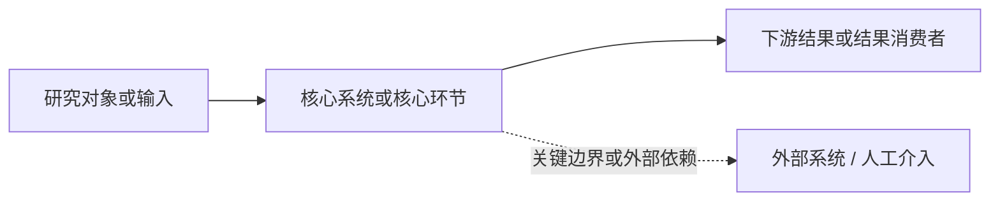
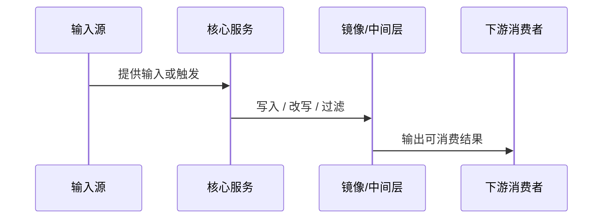

# Technical Report Template

技术版报告的目标不是列出你看过哪些代码，而是让技术读者愿意继续读，并且逐层看懂：
- 这件事到底是什么，为什么值得关心
- 它围绕哪个对象展开，这个对象如何在系统里流转
- 真正决定结果的是哪些规则，而不是执行顺序本身
- 哪些关系、边界、例外和危险断点最值得警惕

## 模板使用原则

- **对象中心**：全文围绕研究对象展开，不围绕研究者看过哪些代码展开。
- **渐进式阅读**：第一屏先给方向和阅读欲望，再给全景图，再带读者进入链路和规则。
- **图是正文，不是装饰**：至少有一张图帮助读者建立空间感、关系感或流转感；没有图的复杂研究报告通常不合格。
- **先翻译，再挂锚点**：先把复杂实现翻译成读者能复述的判断，再把类名、方法名、字段名、表名挂回正文。
- **散文骨架优先**：每个章节先写 2-4 句散文（这件事是什么 + 为什么这样设计 + 改写什么结果），再决定是否补列表、图表或代码。
- **决策链而非执行链**：每节先说"什么规则在决定结果"，再说"代码如何实现这条规则"。
- **证据后移**：证据锚点、边界说明、研究动作默认放在后半段，服务可信度，不要压住读者入口。
- **如果某节没有真实内容，整节删除，不要保留空壳标题**。

## 推荐版式

````markdown
# [场景名称] 深度研究报告

## 1. 先看懂这件事

**[一句话主判断。先说真正决定结果的是什么，再说它带来的代价、错觉或风险。]**

最值得先记住的三件事：

- [读者能默念出来的短判断，不嵌代码，不加括号。]
- [同上。]
- [同上。]

如果你只准备继续排查或改动，先看：

- [一句话点出最值得先下钻的链路、规则或断点。]

---

## 2. 一张图先建立全景

[这一章必须有图。优先放总览图，让读者先知道对象、参与方、边界、上下游和结果分别在哪里。]



[图后面用 2-4 句散文解释：读者在这张图里先要看见什么，为什么这个对象是主角，哪些边界会影响理解。]

---

## 3. 对象入场：它是什么，为什么它是这条链的主角

[先用 2-4 句散文，把研究对象放回宏观场景。回答：它是什么、谁依赖它、为什么不先理解它就看不懂后面的链。]

可按需要补一个小表：

| 项目 | 内容 |
|------|------|
| 研究对象 | [对象名] |
| 它在场景里的角色 | [...] |
| 谁提供输入 | [...] |
| 谁消费结果 | [...] |
| 若它出问题会表现为什么现象 | [...] |

---

## 4. 这条链平时是怎么运转的

[先用 2-4 句散文讲主线：这个对象通常如何进入系统、在哪些阶段被改写、最终如何变成读者可见结果。]

[按场景选择：流程图 / 时序图 / 状态图。只有真的有帮助时才放第二张图。]



[图后再展开 2-4 段正文：不是流水账，而是说明哪几个阶段真正改写结果。]

---

## 5. 真正决定结果的规则

[这一章是全文核心。先写 2-4 句散文，说明真正决定结果的不是入口本身，而是哪几条规则。]

### 5.1 [规则一的判断句]

[为什么系统要这样判断。]
[这条规则会把结果改写成什么。]
[例外或边界是什么。]

### 5.2 [规则二的判断句]

[同上。]

### 5.3 [规则三的判断句]

[同上。]

[如确有必要，可扩到 4-5 条，但不要把所有发现都塞进来。]

---

## 6. 关键例外与危险断点

[先用 2-4 句散文说明：哪些地方最容易打断主线、制造错觉或误导后续维护。]

- [危险断点 1：为什么危险，表象是什么。]
- [危险断点 2：同上。]

---

## 7. 风险与未确认

[只保留真正会改写当前判断的内容。风险要写触发条件和后果；未确认要写缺口和误判后果。]

| 类型 | 内容 |
|------|------|
| 风险 | [...] |
| 风险 | [...] |
| 未确认 | [...] |

---

## 8. 证据尾部

### 8.1 研究边界（确实会改写判断时再保留）

[简要说明没覆盖什么，以及这会不会影响主判断。]

### 8.2 证据回溯表

| 主判断 | 对应结论项 | 证据锚点 |
|--------|------------|----------|
| ... | ... | ... |
````

## 图型选择建议

- **关系图**：对象、参与方、边界和责任最重要时使用。
- **流程图**：链路阶段和去向最重要时使用。
- **时序图**：多参与方交互顺序最重要时使用。
- **状态图**：状态变化最重要时使用。
- **分层图**：宏观结构、边界和分层最重要时使用。

经验法则：
- 第一张图优先解决“这件事整体长什么样”。
- 第二张图才解决“它具体怎么跑”。
- 如果图不能帮助读者更快理解主判断，就删掉它。

## 散文骨架参考

合格的一节散文骨架示例（技术视角）：

> 真正决定最终发货仓库的不是入口服务，而是 `InventoryPoolSorter` 里的得分算法。每个库存池会被计算一个综合得分，得分最低的池子优先被消耗。改变任何一个加分系数，都会改写整批订单的发货结构，因此这个算法是危险改动区。

合格的对象入场示例：

> 这次研究真正的主角不是“拉单任务”本身，而是那份被同步进本地镜像的订单视图。运营、WMS 和补偿任务看到的都不是外部平台原始订单，而是这层被筛选、排序和改写过的镜像。先理解这层镜像，后面的差异、漏单错觉和补偿行为才有解释空间。

不合格示例（执行链流水账）：

> 1. 调用 `OfcOrderVerifyServiceImpl.processVerify()`
> 2. 调用 `InventoryPoolSearchServiceImpl.searchAvailableProductInventoryPool()`
> 3. 调用 `InventoryPoolSorter.sort()`
> 4. 返回排序后的库存池列表
> 5. 按顺序消耗直到满足订单需求

## 退稿自检

写完后，至少用下面六个问题卡一遍自己：

1. 第一屏三条 bullet 里是否出现了反引号、字段名、方法名、括号，或者任何一条已经长到像正文？只要有，就重写第一屏。
2. 第一张图是否真的帮读者先建立了全景，而不是把细节重新堆了一遍？如果没有，就重画。
3. `对象入场` 这一节是否回答了“它是什么、为什么它是主角、为什么值得先懂”？如果没有，这节就还没写成。
4. 是否存在某一节拿掉表格或图后就讲不清因果？如果是，说明这节还缺散文骨架。
5. 读者看完前半部分后，能复述的是“哪几条规则决定结果”，还是只能复述“执行顺序”？如果是后者，说明全文仍然太像台账。
6. 图、表和段落是否都围绕同一个研究对象推进？如果每节都像换了主角，说明报告还没有真正聚焦。
