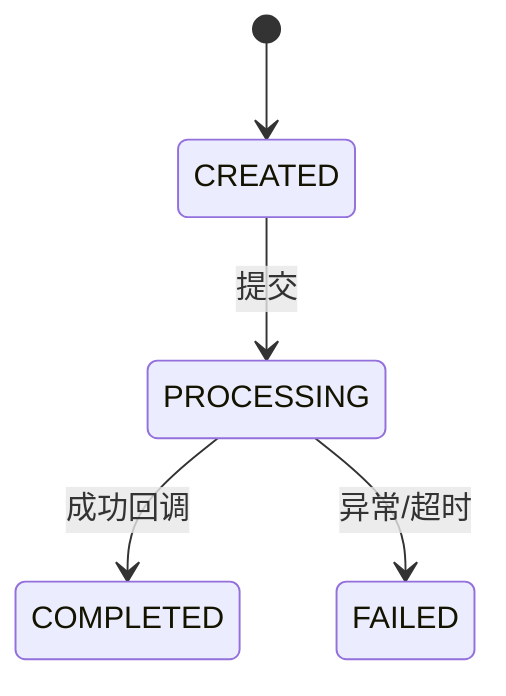

# LightCone 业务图谱记忆系统

> "解析项目万物，洞悉业务本质。"

**核心哲学**：业务逻辑 > 代码结构。Agent 必须先理解业务为什么这样运转，才能理解代码为什么这么写。

**信息密度原则**：单文档承载多层信息，拒绝碎片化。读一篇文档，获得过去需要读3-4篇才能获得的业务洞察。

**深度挖掘原则**：写模式必须发挥模型最大上下文能力，挖掘那些散落在各处的业务规则、跨模块约束、隐式依赖——这些才是代码的真正灵魂。

---

## 目录结构

```
.light-cone/
├── 00-index.md                 # 唯一入口：项目全景 + 快速导航
├── business/
│   ├── context.md              # 项目背景、核心术语、业务边界
│   ├── artifacts/              # 业务产物（高信息密度主文档）
│   │   └── {artifact}.md       # 产物全文档 = 概念 + 生命周期 + 关键代码 trace
│   └── flows/                  # 业务流程（跨产物端到端）
│       └── {flow}.md           # 流程全文档 = 场景 + 参与者 + 数据流转 + 失败传播
├── atlas/                      # 快速检索层（倒排索引）
│   ├── keyword.md              # 业务词/产物/角色 → 文档位置
│   ├── symbol.md               # 类/方法/表/API → 文档位置
│   └── symptom.md              # 故障现象/错误码 → 文档位置 + 根因
└── code/
    └── modules.md              # 代码模块归属（单文件聚合）
```

---

## Read Mode 读模式

### 场景 A：默认代码任务

```
1. 必读: 00-index.md
   └─ 获取项目全景 + 定位目标产物/流程

2. 按目标类型选择：
   ├─ 理解某业务产物 → business/artifacts/{artifact}.md
   ├─ 理解跨产物流程 → business/flows/{flow}.md
   └─ 代码符号定位 → atlas/symbol.md → 跳转对应产物

3. 够用就停。单篇产物文档已包含：
   ├─ Why：为什么存在、业务目标
   ├─ Lifecycle：阶段划分、数据流、消费者
   ├─ Trace：关键调用链、事务边界、副作用顺序
   └─ Deep Business Rules：跨模块约束、隐含依赖、业务不变量
```

### 场景 B：Onboarding / 接手项目

```
1. 00-index.md（项目全景）
2. business/context.md（背景 + 术语 + 边界）
3. business/artifacts/ 下 2-3 个核心产物文档
4. business/flows/ 下 1-2 个主流程文档
```

### 场景 C：故障排查 / 症状检索

```
1. atlas/symptom.md → 按错误现象定位
2. 跳转至对应产物文档的「Failure & Degradation」章节
3. 阅读相关 Trace 章节了解调用链
```

---

## Write Mode 写模式

### 深度挖掘指令

写模式的目标是：**产出那些必须通读整个项目才能得知的业务结论**。

#### Phase 1: 全代码扫描（必须执行）

在创建任何文档前，必须完成：

```
┌─────────────────────────────────────────────────────────────────┐
│  SCAN PHASE - 撑爆上下文也值得                                   │
├─────────────────────────────────────────────────────────────────┤
│ 1. 全局搜索产物相关代码（类名、表名、状态枚举、关键字段）          │
│ 2. 识别所有生产者和消费者（谁创建？谁修改？谁读取？）              │
│ 3. 追踪数据流转（从入口到最终持久化的完整链路）                    │
│ 4. 找出状态机定义（所有可能的状态 + 转换条件 + 触发动作）          │
│ 5. 标记事务边界（哪些操作原子？哪些异步？哪些可能不一致？）         │
│ 6. 识别副作用（发送消息、调用外部API、写缓存、发通知）             │
│ 7. 找出业务不变量（必须始终保持为真的规则，如"已付款必有账单"）    │
└─────────────────────────────────────────────────────────────────┘
```

#### Phase 2: 深度挖掘清单（必须回答）

每个产物文档必须深挖以下维度：

| 挖掘维度 | 必须回答的问题 | 示例（物流订单） |
|---------|---------------|----------------|
| **跨模块耦合** | 哪些其他模块隐式依赖此产物？ | 财务模块依赖订单状态做结算，但订单状态变更是异步的 |
| **隐式状态规则** | 状态值之间有什么隐藏约束？ | `status=COMPLETED` 时必须有 `actualDeliveryTime`，但代码不强制检查 |
| **时序依赖** | 操作顺序错误会导致什么业务问题？ | 必须先扣款再推送承运商，否则可能产生坏账 |
| **数据一致性边界** | 哪些数据可能不一致？什么情况下？ | 订单状态已更新但轨迹未同步，中间窗口期约5秒 |
| **失败级联** | 此产物失败会影响哪些看似无关的业务？ | 订单取消可能影响已生成的对账单，需触发反冲 |
| **业务兜底规则** | 极端情况下系统如何自保？ | 承运商长时间未回调，自动超时关闭并退款 |
| **人工介入点** | 哪些状态需要人工处理？触发条件？ | 异常挂起超过24小时转人工，需运营确认 |

#### Phase 3: 高信息密度写作

将以上发现写入 `{artifact}.md`，使用紧凑结构：

```markdown
# {artifact}.md 标准结构

## Frontmatter（机器可读元数据）

## Why Exists（存在理由）
- 一句话定义
- 业务目标
- 失败影响范围

## Lifecycle（生命周期全景）

### Stages（阶段矩阵）
| Stage | Trigger | Actor | Input | Processing | Output | Persist | Next Consumer |
|-------|---------|-------|-------|------------|--------|---------|---------------|

### Data Flow（数据流矩阵）
| Data | Source | Transform | Stored | Exposed Via | Consumed By | Failure Impact |
|------|--------|-----------|--------|-------------|-------------|----------------|

### State Machine（状态机）


## Deep Business Rules（深度业务规则）★ 核心章节

### Cross-Module Constraints（跨模块约束）
- `{模块A}` 隐式依赖 `{模块B}` 的 `{条件}`，当 `{场景}` 时可能不一致
- 约束示例：财务结算只处理 `status=COMPLETED` 的订单，但订单完成回调和结算任务是异步的，可能产生漏结

### Implicit Dependencies（隐式依赖）
- `{实体}.{字段}` 实际由 `{代码位置}` 维护，但 `{其他代码}` 直接读取不做校验
- 依赖示例：`order.trackingNo` 由承运商回调写入，但查询接口不做空值兜底，可能NPE

### Business Invariants（业务不变量）
| Invariant | Enforced By | Violation Scenario | Impact |
|-----------|-------------|-------------------|--------|
| `status=PAID → paymentRecord != null` | PaymentService | 支付回调重复触发 | 重复扣款 |
| `status=SHIPPED → trackingNo != null` | CarrierCallback | 承运商异常返回空单号 | 无法跟踪 |

### Temporal Rules（时序规则）
| Order | Operation A | Operation B | Violation Impact |
|-------|-------------|-------------|------------------|
| 必须 | 创建账单 | 扣款 | 先扣款后创建账单，无法追溯 |
| 禁止 | 取消订单 | 推送承运商 | 承运商已接单，取消无效 |

## Trace（关键代码追踪）

### Core Call Chain（核心调用链）
```
Entry: Controller.method()
  → Service.entryMethod() [事务开始]
    → Service.subMethod1() [副作用: 发消息]
    → Service.subMethod2() [异步: 外部API]
  → [事务提交]
  → AsyncHandler.callback() [事务外]
```

### Transaction & Async Boundaries（事务/异步边界）
- `{method}()`：在事务内，失败回滚
- `{method}()`：异步执行，失败不重试，丢入死信队列
- `{method}()`：外部API调用，超时=30s，不重试

### Dangerous Change Points（危险改动点）
| Location | Risk | Rule |
|----------|------|------|
| `{method}() L{line}` | 改动导致事务边界变化 | 必须与 {其他方法} 保持一致 |
| `{field}` 赋值位置 | 状态机漏状态 | 新增状态必须同步修改 {校验方法} |

## Failure & Degradation（失败与降级）

| Scenario | System Behavior | Business Impact | Recovery |
|----------|-----------------|-----------------|----------|
| {失败场景} | {系统如何反应} | {业务损失} | {如何恢复} |

## Evidence Anchors（证据锚点）
- 核心类：`{ClassName}` @ `{file}`
- 状态枚举：`{EnumName}` @ `{file}`
- 数据库表：`{table_name}`
```

---

## 文档规范

### 1. Frontmatter Schema（所有文档必填）

```yaml
---
type: artifact | flow | context | index
name: {机器可读标识}
title: {人类可读标题}
coverage: complete | partial | stub
last_verified: YYYY-MM-DD
confidence: high | medium | low
---
```

### 2. 信息密度规则

**禁止**：
- 只有方法名，没有业务目的说明
- 只有状态列表，没有转换规则
- 只有流程步骤，没有输入输出消费者
- 低价值的中间索引文件

**强制**：
- 每个 Stage 必须说明 Trigger + Input + Output + Consumer
- 每个状态转换必须说明条件 + 副作用
- 每个方法必须标注事务/异步边界
- 必须显式声明业务不变量和跨模块约束

### 3. 文档合并原则

| 场景 | 处理方式 | 说明 |
|---------|-----------|---------|
| 产物文档分散 | 合并为单文件 | `artifact-X.md` + `lifecycle.md` + `trace-Y.md` → `business/artifacts/X.md` |
| 中间索引文件 | 删除收拢 | 将中间索引层的功能收拢到 `00-index.md` |
| 模块文件过多 | 单文件聚合 | 多个 `module-X.md` → 单个 `code/modules.md` |

---

## Growth Rules

### 何时创建产物文档

满足任一：
1. 有独立业务目标（解决特定问题）
2. 有明确生命周期（>1 个状态）
3. 有多个消费者
4. 失败会影响其他业务

### 何时创建流程文档

满足任一：
1. 跨 2+ 个产物
2. 端到端数据流转复杂
3. 失败传播路径非直观

### 何时更新文档

1. **代码变更后**：验证变更已落代码，同步更新对应产物/流程文档
2. **发现隐式依赖**：任何新发现的跨模块耦合必须立即记录
3. **故障复盘后**：将根因和症状写入 `atlas/symptom.md` 和对应产物文档

---

详细模板、示例和编写指南见 [reference.md](reference.md)。
