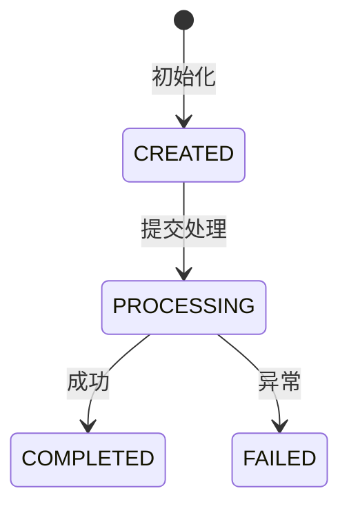

# {业务名称}

## Why Exists

**一句话定义**：{这个产物是什么}

**业务目标**：{解决谁的什么问题}

**失败影响**：{失败时影响什么业务}

**无影响范围**：{失败时不影响什么，可降级}

## Lifecycle

### Stages（阶段矩阵）

| Stage | Trigger | Actor | Input | Processing | Output | Persist | Next Consumer |
|-------|---------|-------|-------|------------|--------|---------|---------------|
| {stage-1} | {trigger} | {actor} | {input} | {processing} | {output} | {persist} | {consumer} |

### Data Flow（数据流矩阵）

| Data | Source | Transform | Stored | Exposed Via | Consumed By | Failure Impact |
|------|--------|-----------|--------|-------------|-------------|----------------|
| {data-1} | {source} | {transform} | {stored} | {exposed} | {consumer} | {impact} |

### State Machine（状态机）



**状态说明**：

| State | Meaning | Allowed Transitions | Business Rule |
|-------|---------|---------------------|---------------|
| {state} | {含义} | {可转换到} | {约束} |

## Deep Business Rules ★

### Cross-Module Constraints（跨模块约束）

```
约束1: {模块A} 依赖 {模块B} 的 {条件}
- 场景: {什么情况下}
- 风险: {违反时发生什么}
- 代码位置: {file:line}
```

### Implicit Dependencies（隐式依赖）

```
依赖1: {字段} 实际由 {X} 维护，{Y} 直接读取
- 假设: {Y} 假设 {条件}
- 违反场景: {什么情况}
- 后果: {会发生什么}
```

### Business Invariants（业务不变量）

| Invariant | Enforced By | Violation Scenario | Impact | Detection |
|-----------|-------------|-------------------|--------|-----------|
| {规则} | {谁保证} | {什么情况下} | {后果} | {如何发现} |

### Temporal Rules（时序规则）

| Order | Operation A | Operation B | Violation Impact | Enforced By |
|-------|-------------|-------------|------------------|-------------|
| MUST | {操作A} | {操作B} | {后果} | {机制} |
| MUST_NOT | {操作A} | {操作B} | {后果} | {机制} |

## Trace（代码追踪）

### Core Call Chain

```
{EntryPoint}
  → {Method1}() [{事务边界}]
    → {Method2}() [副作用: {说明}]
    → {Method3}() [异步: {说明}]
  → [{事务提交/结束}]
  → {AsyncHandler}()
```

### Transaction & Async Boundaries

| Method | Type | Notes |
|--------|------|-------|
| `{method}()` | Transactional | 回滚范围: {说明} |
| `{method}()` | Async | 线程池: {pool}, 超时: {time} |
| `{method}()` | External API | 超时: {time}, 重试: {yes/no} |

### Side Effects（副作用顺序）

| Order | Effect | Trigger | Compensate On Failure |
|-------|--------|---------|----------------------|
| 1 | {副作用} | {触发点} | {补偿方式} |

### Dangerous Change Points

| Location | Current Logic | Risk If Changed | Validation Rule |
|----------|---------------|-----------------|-----------------|
| `{ClassName}#{method}({ParamType})` | {当前逻辑} | {改动风险} | {必须遵守的规则} |

> **格式说明**：使用 `ClassName#method(ParamType)` 签名格式，不记录行号。行号在代码 Insert/Delete 后会漂移且无法自动检测。Agent 可用 Grep 工具一步定位方法。

## Failure & Degradation

| Scenario | Behavior | Business Impact | Recovery | Related Code |
|----------|----------|-----------------|----------|--------------|
| {场景} | {表现} | {影响} | {恢复} | {代码位置} |

## Evidence Anchors

### Core Classes
- `{ClassName}`: `{package}/{ClassName}.java`

### Enums
- `{StatusEnum}`: `{package}/{StatusEnum}.java`

### DB Tables
- `{table}`: `{ddl-file}.sql`

### Key Methods
- `{ClassName}#{method}({ParamType})` — {核心逻辑描述}

> **格式说明**：使用方法签名 + 语义描述，不记录行号。示例：`OrderService#cancel(Long)` — 先退款再改状态，需保证事务内完成

## Related

- **Flows**: [{flow}](business/flows/{flow}.md)
- **Related Artifacts**: [{artifact}](business/artifacts/{artifact}.md)
