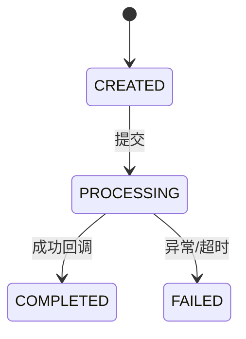

# LightCone 业务图谱记忆系统

> "解析项目万物，洞悉业务本质。"

**核心哲学**：业务逻辑 > 代码结构。Agent 必须先理解业务为什么这样运转，才能理解代码为什么这么写。

**信息密度原则**：单文档承载多层信息，拒绝碎片化。读一篇文档，获得过去需要读3-4篇才能获得的业务洞察。

**深度挖掘原则**：写模式必须发挥模型最大上下文能力，挖掘那些散落在各处的业务规则、跨模块约束、隐式依赖——这些才是代码的真正灵魂。

**证据优先原则**：结论强度不能超过证据强度。接口名、DTO 字段、注释、外部系统术语只能作为线索，不能单独证明项目定位、业务边界或系统归属。

**边界克制原则**：优先写「代码已证明什么」，再写「基于证据可推断什么」，最后单列「仍待验证什么」。高信息密度不等于高确定性。

---

## 目录结构

```
.light-cone/
├── 00-index.md                 # 唯一入口：项目全景 + 快速导航
├── business/
│   ├── context.md              # 项目背景、核心术语、业务边界
│   ├── artifacts/              # 业务产物（高信息密度主文档）
│   │   └── {artifact}.md       # 产物全文档 = 概念 + 生命周期 + 关键代码 trace
│   └── flows/                  # 业务流程（跨产物端到端）
│       └── {flow}.md           # 流程全文档 = 场景 + 参与者 + 数据流转 + 失败传播
├── atlas/                      # 快速检索层（倒排索引）
│   ├── keyword.md              # 业务词/产物/角色 → 文档位置
│   ├── symbol.md               # 类/方法/表/API → 文档位置
│   └── symptom.md              # 故障现象/错误码 → 文档位置 + 根因
├── code/
│   └── modules.md              # 代码模块归属（单文件聚合）
└── schema/                     # 数据 Schema 层【新增】
    ├── overview.md             # 数据总览 + ER图
    ├── tables/                 # 单表/集合详情
    │   └── {table_name}.md     # 结构 = DDL + 字段含义 + 关联关系
    └── relations.md            # 数据关系矩阵（全局视图）
```

---

## Read Mode 读模式

### 场景 A：默认代码任务

```
1. 必读: 00-index.md
   └─ 获取项目全景 + 定位目标产物/流程

2. 按目标类型选择：
   ├─ 理解某业务产物 → business/artifacts/{artifact}.md
   ├─ 理解跨产物流程 → business/flows/{flow}.md
   └─ 代码符号定位 → atlas/symbol.md → 跳转对应产物

3. 够用就停。单篇产物文档已包含：
   ├─ Why：为什么存在、业务目标
   ├─ Lifecycle：阶段划分、数据流、消费者
   ├─ Trace：关键调用链、事务边界、副作用顺序
   └─ Deep Business Rules：跨模块约束、隐含依赖、业务不变量
```

### 场景 B：Onboarding / 接手项目

```
1. 00-index.md（项目全景）
2. business/context.md（背景 + 术语 + 边界）
3. business/artifacts/ 下 2-3 个核心产物文档
4. business/flows/ 下 1-2 个主流程文档
```

### 场景 C：故障排查 / 症状检索

```
1. atlas/symptom.md → 按错误现象定位
2. 跳转至对应产物文档的「Failure & Degradation」章节
3. 阅读相关 Trace 章节了解调用链
```

### 场景 D：理解数据模型 / Schema

```
1. 必读: schema/overview.md
   └─ 获取数据全景 + ER图

2. 按目标选择：
   ├─ 理解单表/集合结构 → schema/tables/{table}.md
   ├─ 理解数据间关系 → schema/relations.md
   └─ 定位表归属 → atlas/symbol.md Tables 章节

3. 关联业务含义：
   └─ 表文档中的「业务产物归属」→ 跳转对应 artifact.md
```

### 场景 E：理解业务概念 / 实体与术语

```
1. 必读: atlas/entities.md
   └─ 获取业务实体全景 + 逻辑模型

2. 查找业务术语：
   ├─ 术语定义 → atlas/glossary.md
   ├─ 术语与字段映射 → schema/tables/{table}.md 字段血缘
   └─ 术语归属 → business/artifacts/{artifact}.md

3. 从物理数据反查业务含义：
   └─ 表文档中的「逻辑实体归属」→ 跳转 atlas/entities.md
```

---

## Write Mode 写模式

### 执行策略：主动拆分子代理

Write Mode 的扫描工作天然适合并行——**主 agent 应默认拆分子代理执行，而不是等用户要求**。原因：

1. **扫描维度彼此独立**：状态机追踪、副作用识别、数据关系挖掘等可以同时进行，互不阻塞
2. **深度换速度**：每个子代理聚焦一个子问题，能往更深走；串行执行时主 agent 上下文被全量代码占满，反而看不深
3. **更好的结论质量**：各子代理独立取证，再由主 agent 交叉审查，比单线程扫描更能发现矛盾与遗漏

**何时必须拆子代理：**

| 场景 | 拆法 |
|------|------|
| 初建记忆（全新项目） | 每个产物/流程一个子代理并行探查；主 agent 收口汇总 |
| 更新记忆（增量变更） | 变更涉及多个模块时，每个模块一个子代理；单模块变更可内联执行 |
| Phase 1 扫描 | 将 20 项扫描维度按类分组（状态机/副作用/数据关系/时序依赖），至少拆 3-4 个并行子代理 |
| 同时需生成多篇文档 | 每篇文档一个子代理起草，主 agent 审查合并 |

**子代理分工模板（Phase 1 参考）：**

```
子代理 A — 业务核心流：状态机、调用链、事务边界（扫描项 1-6）
子代理 B — 数据层：DDL/ORM、数据关系、字段血缘、业务约束（扫描项 8-14）
子代理 C — 跨模块：隐式依赖、级联操作、时序敏感操作、疑点（扫描项 15-20）
主 agent — 收集三路报告 → 交叉审查矛盾 → 执行 Phase 2-5
```

> 如果当前环境不支持子代理（如纯对话场景），退化为串行执行 Phase 1，但须在开始前声明这一限制。

---

### 深度挖掘指令

写模式的目标是：**产出那些跨证据归纳、经得起反向审查的业务结论**。高信息密度不等于高确定性；越关键的结论，越要先过记忆审查。

#### Phase 1: 全代码扫描（必须执行）

在创建任何文档前，必须完成：

```
┌─────────────────────────────────────────────────────────────────┐
│  SCAN PHASE - 撑爆上下文也值得                                   │
├─────────────────────────────────────────────────────────────────┤
│ 1. 全局搜索产物相关代码（类名、表名、状态枚举、关键字段）          │
│ 2. 识别所有生产者和消费者（谁创建？谁修改？谁读取？）              │
│ 3. 追踪数据流转（从入口到最终持久化的完整链路）                    │
│ 4. 找出状态机定义（所有可能的状态 + 转换条件 + 触发动作）          │
│ 5. 标记原子操作边界（哪些操作原子？哪些异步？哪些可能不一致？）     │
│ 6. 识别副作用（发送消息、调用外部 API、写缓存、发通知）            │
│ 7. 找出业务不变量（必须始终保持为真的规则）                        │
│ 8. 扫描数据结构定义（DDL、ORM 实体类、Schema 定义、迁移文件）      │
│ 9. 识别数据间关系（外键、隐式关联、关联查询模式）                  │
│ 10. 记录业务约束（非空、唯一、默认值背后的业务规则）               │
│ 11. 识别业务实体（从数据定义中找出逻辑实体及其物理分布）           │
│ 12. 分析字段血缘（原生字段 vs 计算字段 vs 冗余字段）               │
│ 13. 提取业务术语（建立术语到物理字段的映射）                       │
│ 14. 检查数据质量约束（主键、空值、一致性规则）                     │
│                                                                 │
│ 【数据关系深度挖掘 - 关键】                                        │
│ 15. 扫描业务逻辑层（不只是数据结构定义）：                         │
│     - 哪些方法/函数同时操作多张表/集合？                          │
│     - 原子操作边界内的跨表操作序列                                 │
│     - 关联查询模式（哪些表经常一起查，关联条件是什么）             │
│     - 代码中的 ID 传递（隐式引用，无物理约束但业务关联）           │
│ 16. 追踪级联操作：                                                │
│     - 创建 A 时必定创建哪些关联 B？                               │
│     - 状态变更会触发哪些关联数据更新？                             │
│     - 删除/作废的传播路径                                         │
│ 17. 识别时序敏感的数据操作：                                       │
│     - 操作 A 必须在操作 B 之前？顺序错误的影响？                    │
│     - 哪些是异步的，可能产生不一致窗口？                           │
│ 18. 区分证据类型：                                                 │
│     - 直接证据：调用链、状态机、核心表、事务边界、运行配置          │
│     - 辅助证据：命名、DTO 字段、注释、外部系统术语                  │
│ 19. 标记边界：                                                     │
│     - 哪些是本仓库直接拥有的能力？哪些只是对接/适配/消费外部系统？  │
│ 20. 记录疑点：                                                     │
│     - 哪些地方证据不足、证据冲突、或仍无法闭环？                    │
└─────────────────────────────────────────────────────────────────┘
```

#### Phase 2: 结论草稿（必须先做）

在写正文前，先列一份“候选结论清单”，至少覆盖以下字段：

| 候选结论 | 结论类型 | 证据锚点 | 当前判断 | 正文去向 |
|---------|----------|----------|----------|----------|
| `{结论}` | 事实 / 推断 / 待验证 | `{ClassName}#{method}()` / `{table}` / `{config}` | 证据充分 / 需降级 / 暂不下结论 | Why Exists / Boundary & Confidence / To Verify |

判定规则：

- **事实**：有直接证据支持，且可回指到调用链、状态机、数据流、核心表、配置或项目文档中的至少一个强锚点。
- **推断**：由多个证据共同指向，但仍带条件或解释空间；可以写，但必须注明依据和适用边界。
- **待验证**：只有命名、DTO、字段、注释、局部接口、单处术语，或证据互相冲突、无法闭环；不能冒充事实。

额外要求：

- 涉及**项目定位、业务边界、系统归属、某能力是否为“自有核心域”**的结论，必须至少有 2 个独立锚点，且至少 1 个来自真实行为证据（调用链 / 状态机 / 数据流 / 核心持久化 / 主流程）。
- 如果只看到 `Client`、`Adapter`、`OpenAPI`、回调接口、第三方字段映射等痕迹，默认只能得出“存在对接/适配/消费外部能力”的结论，不能顺手补全成本系统自有业务域。

#### Phase 3: 记忆审查（必须通过）

在候选结论进入文档前，逐条执行：

1. **事实审查**
   - 这个结论是否真的被代码、DDL、配置、项目文档直接证明？
   - 若去掉命名、注释、术语暗示，这个结论还站得住吗？

2. **边界审查**
   - 我写的是“本仓库直接拥有的能力”，还是“本仓库对接的外部能力”？
   - 我是不是把外部系统术语、回调协议、DTO 命名误写成了内部业务边界？

3. **反向否证**
   - 能否构造一个更保守但同样解释代码的说法？
   - 若两种解释都成立，必须选择更保守的一种，并把更强判断移入 `To Verify`。

4. **降级改写**
   - 能证实的写进 `Why Exists` / `00-index` / `context.md`
   - 证据支持但仍需解释的写进 `Boundary & Confidence`
   - 证据不足的写进 `To Verify`

#### Phase 4: 深度挖掘清单（只对已过审结论展开）

每个产物文档必须深挖以下维度：

| 挖掘维度 | 必须回答的问题 | 参考示例 |
|---------|---------------|---------|
| **跨模块耦合** | 哪些其他模块隐式依赖此产物？ | 结算任务依赖主单终态，但状态刷新异步，可能漏处理 |
| **隐式状态规则** | 状态值之间有什么隐藏约束？ | `status=COMPLETED` 时必须有完成时间，但代码未统一校验 |
| **时序依赖** | 操作顺序错误会导致什么业务问题？ | 必须先落审计记录再改终态，否则无法追溯 |
| **数据一致性边界** | 哪些数据可能不一致？什么情况下？ | 主状态已更新但聚合视图未刷新，中间存在窗口期 |
| **失败级联** | 此产物失败会影响哪些看似无关的业务？ | 主单撤销后，需要同步反冲已生成的对账快照 |
| **业务兜底规则** | 极端情况下系统如何自保？ | 下游长时间无响应时转人工补偿，避免无限重试 |
| **人工介入点** | 哪些状态需要人工处理？触发条件？ | 异常状态超过阈值后转运营确认 |
| **实体边界** | 同一业务实体分散在哪些物理表？ | 实体分布在主表、扩展表、关系表 |
| **字段来源** | 字段是原生存储还是计算得出？ | `total_amount` 由多个原始字段计算而来 |
| **术语歧义** | 不同模块对同一概念的不同叫法？ | “申请单”在不同模块中也叫“任务单”或“主单” |

#### Phase 5: 高信息密度写作

将以上发现写入 `{artifact}.md`，使用紧凑结构：

```markdown
# {artifact}.md 标准结构

## Frontmatter（机器可读元数据）

## Why Exists（只写已证实内容）
- 一句话定义
- 业务目标
- 失败影响范围
- 无影响范围

## Boundary & Confidence（边界与置信度）

### Confirmed Facts（已证实事实）
- `{结论}` — 证据：`{ClassName}#{method}()` / `{table_name}`

### Evidence-backed Inferences（证据支持的推断）
- `{结论}` — 基于 `{evidence}` 归纳；限制：`{limit}`

### To Verify（待验证事项）
- `{疑点}` — 当前缺失 `{missing_evidence}`

## Lifecycle（生命周期全景）

### Stages（阶段矩阵）
| Stage | Trigger | Actor | Input | Processing | Output | Persist | Next Consumer |
|-------|---------|-------|-------|------------|--------|---------|---------------|

### Data Flow（数据流矩阵）
| Data | Source | Transform | Stored | Exposed Via | Consumed By | Failure Impact |
|------|--------|-----------|--------|-------------|-------------|----------------|

### State Machine（状态机）


## Deep Business Rules（深度业务规则）★ 核心章节

### Cross-Module Constraints（跨模块约束）
- `{模块A}` 隐式依赖 `{模块B}` 的 `{条件}`，当 `{场景}` 时可能不一致
- 约束示例：报表任务只处理 `status=COMPLETED` 的记录，但状态刷新和报表扫描异步，可能产生漏处理

### Implicit Dependencies（隐式依赖）
- `{实体}.{字段}` 实际由 `{代码位置}` 维护，但 `{其他代码}` 直接读取不做校验
- 依赖示例：`task.resultCode` 由回调更新，而查询接口默认其在终态后非空

### Business Invariants（业务不变量）
| Invariant | Enforced By | Violation Scenario | Impact |
|-----------|-------------|-------------------|--------|
| `status=PAID → paymentRecord != null` | PaymentService | 支付回调重复触发 | 重复扣款 |
| `status=COMPLETED → completedAt != null` | StatusUpdater | 手工改库 | 无法追溯完成时间 |

### Temporal Rules（时序规则）
| Order | Operation A | Operation B | Violation Impact |
|-------|-------------|-------------|------------------|
| 必须 | 记录审计日志 | 修改终态 | 先改终态后记日志，无法追溯 |
| 禁止 | 作废主单 | 推送下游后 | 下游已消耗数据，作废无效 |

## Trace（关键代码追踪）

### Core Call Chain（核心调用链）
```
Entry: Controller.method()
  → Service.entryMethod() [事务开始]
    → Service.subMethod1() [副作用: 发消息]
    → Service.subMethod2() [异步: 外部 API]
  → [事务提交]
  → AsyncHandler.callback() [事务外]
```

### Transaction & Async Boundaries（事务/异步边界）
- `{method}()`：在事务内，失败回滚
- `{method}()`：异步执行，失败不重试，丢入死信队列
- `{method}()`：外部 API 调用，超时=30s，不重试

### Dangerous Change Points（危险改动点）
| Location | Risk | Rule |
|----------|------|------|
| `{ClassName}#{method}({ParamTypes})` | 改动导致事务边界变化 | 必须与 {其他方法} 保持一致 |
| `{field}` 赋值位置 | 状态机漏状态 | 新增状态必须同步修改 {校验方法} |

## Failure & Degradation（失败与降级）

| Scenario | System Behavior | Business Impact | Recovery |
|----------|-----------------|-----------------|----------|
| {失败场景} | {系统如何反应} | {业务损失} | {如何恢复} |

## Evidence Anchors（证据锚点）
> **不记录行号**。用 `ClassName#method(ParamType)` 标准签名格式，Agent 可用搜索工具一步定位。行号在任何 Insert/Delete 后失效且无法自动检测，是「自信但错误」的锚点。

- 核心类：`{ClassName}` @ `{file}`
- 关键方法：`{ClassName}#{method}({ParamTypes})` — {一句话描述核心逻辑/副作用}
- 状态枚举：`{EnumName}` @ `{file}`
- 数据库表：`{table_name}`
```

写作约束：

- `Why Exists`、`00-index.md`、`business/context.md` 中的项目定位，只能使用 `Confirmed Facts` 已支持的结论。
- `Evidence-backed Inferences` 可以保留高信息量判断，但必须显式写出依据和限制，不能伪装成系统自我定位。
- `To Verify` 不是失败区，而是防止记忆文档把“线索”误写成“事实”的缓冲区。

---

## 文档规范

### 1. Frontmatter Schema（所有文档必填）

```yaml
---
type: artifact | flow | context | index | schema-overview | schema-table | schema-relations
name: {机器可读标识}
title: {人类可读标题}
coverage: complete | partial | stub
last_verified: YYYY-MM-DD
confidence: high | medium | low
---
```

### 2. 事实 / 推断 / 待验证分层

| 类型 | 允许写入的位置 | 证据要求 | 写法要求 |
|---------|----------------|----------|----------|
| **事实** | `Why Exists`、`00-index.md`、`business/context.md`、各章节主结论 | 至少一个强锚点 | 直接陈述，但必须可回指证据 |
| **推断** | `Boundary & Confidence`、章节备注 | 多个证据共同指向 | 明写“基于什么推断”以及“限制是什么” |
| **待验证** | `To Verify`、复盘清单 | 证据不足 / 证据冲突 | 只能提问或保守表述，不能写成定论 |

`confidence` 字段解释：

- `high`：关键结论都有直接证据，且边界判断基本闭环
- `medium`：核心流程可信，但部分边界或术语解释仍带推断
- `low`：仍以线索和待验证项为主，不能输出强定位结论

### 3. 信息密度规则

**禁止**：
- 只有方法名，没有业务目的说明
- 只有状态列表，没有转换规则
- 只有流程步骤，没有输入输出消费者
- 低价值的中间索引文件
- 仅凭命名、注释、DTO 字段、外部术语就下项目定位或业务边界结论
- 把 `To Verify` 中的疑点写进 `Why Exists`、项目简介、核心边界说明

**强制**：
- 每个 Stage 必须说明 Trigger + Input + Output + Consumer
- 每个状态转换必须说明条件 + 副作用
- 每个方法必须标注事务/异步边界
- 必须显式声明业务不变量和跨模块约束
- 每个关键结论必须能回指证据锚点
- 每个推断都要说明依据和适用边界

### 4. 文档合并原则

| 场景 | 处理方式 | 说明 |
|---------|-----------|---------|
| 产物文档分散 | 合并为单文件 | `artifact-X.md` + `lifecycle.md` + `trace-Y.md` → `business/artifacts/X.md` |
| 中间索引文件 | 删除收拢 | 将中间索引层的功能收拢到 `00-index.md` |
| 模块文件过多 | 单文件聚合 | 多个 `module-X.md` → 单个 `code/modules.md` |

---

## Growth Rules

### 何时创建产物文档

满足任一：
1. 有独立业务目标（解决特定问题）
2. 有明确生命周期（>1 个状态）
3. 有多个消费者
4. 失败会影响其他业务

### 何时创建流程文档

满足任一：
1. 跨 2+ 个产物
2. 端到端数据流转复杂
3. 失败传播路径非直观

### 何时更新文档

1. **代码变更后**：验证变更已落代码，同步更新对应产物/流程文档
2. **发现隐式依赖**：任何新发现的跨模块耦合必须立即记录
3. **故障复盘后**：将根因和症状写入 `atlas/symptom.md` 和对应产物文档

### 何时创建 Schema 文档

#### 何时创建单表文档 (schema/tables/{table}.md)

满足任一：
1. 表有明确的业务归属（是某个 artifact 的持久化载体）
2. 表有 2+ 个外键关联（关系复杂）
3. 表被 3+ 个不同模块查询
4. 表包含业务关键状态字段

#### 何时创建 Schema 总览 (schema/overview.md)

满足任一：
1. 数据库表数量 > 10
2. 存在 N:M 关系或多对多关联表
3. 需要理解跨表业务约束

#### 何时创建 Schema 关系文档 (schema/relations.md)

满足任一：
1. 数据表/集合数量 > 5
2. 存在跨数据业务约束（如"审批通过必有账单"）
3. 需要理解数据关系背后的业务规则

**编写原则**：
- **不止于外键/引用**：必须包含代码层面的隐式关联（关联查询模式、应用层维护的 ID 关系）
- **关联业务产物**：引用对应 artifact.md 中的跨模块约束和时序规则
- **显式业务不变量**：哪些跨数据状态必须同时为真？违背的影响是什么？
- **时序敏感操作**：哪些跨数据操作有严格的先后顺序？

**质量检验**：
- [ ] 能回答"删除这行数据会影响哪些业务？"
- [ ] 能指出"哪些数据必须在同一原子操作内处理？"
- [ ] 能说明"数据关系背后的业务时序约束"

#### 何时更新 Schema 文档

1. **DDL 变更后**：发现新的 migration、实体类修改
2. **发现新的表关系**：代码中出现新的 JOIN 模式
3. **表结构解释业务问题**：字段含义帮助理解业务规则

### 行号禁用规则（重要）

- **禁止**在任何文档中写 `{file}:{line}` 或 `L{数字}` 格式
- 代码定位统一使用 `ClassName#method(ParamType)` 签名格式
- 若需指出「某段逻辑」，用关键字描述（如「`OrderService#deductOrder` 内 UNPAID 过滤循环」）而非行号

---

详细模板、示例和编写指南见 [reference.md](reference.md)。
