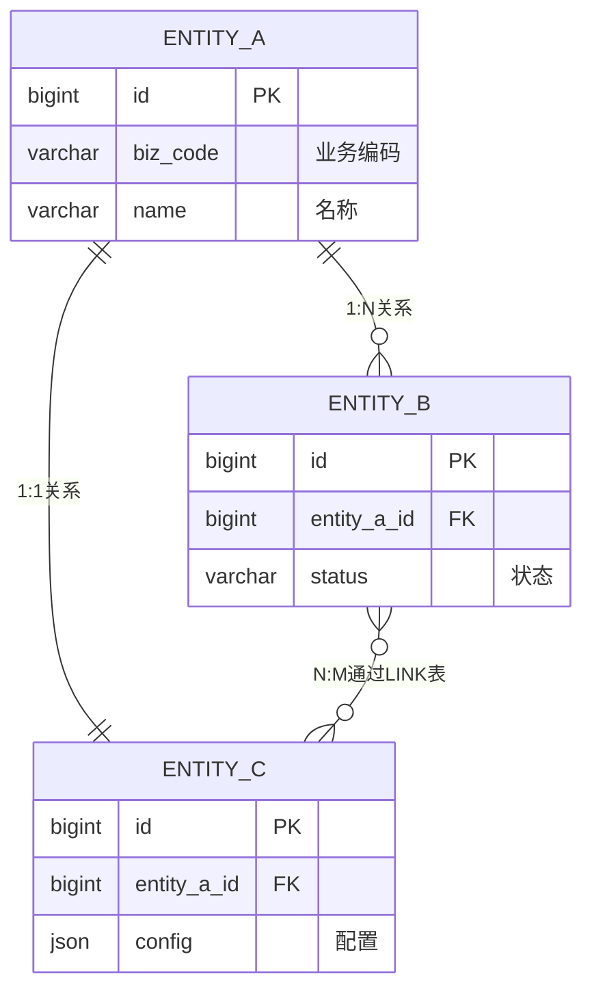

# 业务实体映射表

> 本文档建立**技术元数据 → 业务语义**的桥梁，记录从物理表结构逆向分析得到的业务实体概念。
> 物理表详情见 [schema/tables/](../schema/tables/) 目录。

## 实体总览

| 统计项 | 数量 |
|--------|------|
| 业务实体数 | {N} |
| 物理表数 | {M} |
| 一对多映射（1实体→N表） | {K} |
| ID体系数 | {L} |

## 业务实体清单

### {entity-name}

**一句话定义**: {业务实体的核心定义，仅写已证实内容}

**边界提示**:
- Confirmed Fact: {可由表、字段、查询模式直接支持的实体结论}
- Inference: {基于多表共现、关联查询可推断的实体边界；说明限制}
- To Verify: {仍不确定是否应拆成独立实体、或只是外部系统镜像}

**物理分布**: 该实体的数据分散在以下物理表

| 物理表 | 作用 | 关键字段 | 数据规模 |
|--------|------|----------|----------|
| [{table_1}](../schema/tables/{table_1}.md) | {主表/扩展表/关系表} | {primary_key}, {field1}, {field2} | {规模} |
| [{table_2}](../schema/tables/{table_2}.md) | {作用} | {foreign_key}, {field3} | {规模} |

**ID体系映射**:

| ID类型 | 字段名 | 所在表 | 说明 | 使用场景 |
|--------|--------|--------|------|----------|
| 主键 | `id` | {table_1} | 技术自增ID | 内部关联 |
| 业务ID | `{biz_id}` | {table_1} | 业务唯一标识 | 对外暴露 |
| 外部ID | `{external_id}` | {table_2} | 第三方系统ID | 外部集成 |

**关联实体**:
- 一对一: [{entity_a}](#entity-a) — {关系说明}
- 一对多: [{entity_b}](#entity-b) — {关系说明}
- 多对多: [{entity_c}](#entity-c) — 通过 `{link_table}` 关联

---

## 实体关系图

## 主键识别矩阵

| 实体 | 技术主键 | 业务主键 | 备用键 | 说明 |
|------|----------|----------|--------|------|
| {entity_a} | `id` | `code` | `name` | 业务主键唯一但可修改 |
| {entity_b} | `id` | `order_no` | - | 业务主键不可修改 |

## 常见问题与陷阱

### ID混淆

| 问题 | 示例 | 影响 | 解决 |
|------|------|------|------|
| 技术ID与业务ID混用 | 用`id`而非`order_no`对外暴露 | 外部系统无法识别 | 始终使用业务ID对外 |
| 多系统ID映射错误 | 将`customer_no`当`user_id`用 | 关联错误用户 | 建立ID映射表 |

### 实体边界模糊

| 场景 | 说明 | 处理建议 |
|------|------|----------|
| {entity_a}与{entity_b}界限不清 | {说明} | {建议} |

## Evidence Anchors

- 实体识别来源: `{ClassName}#{method}()` 中的关联查询
- ID生成逻辑: `{IdGenerator}#generate()`
- 实体校验规则: `{Validator}#validate{Entity}()`
