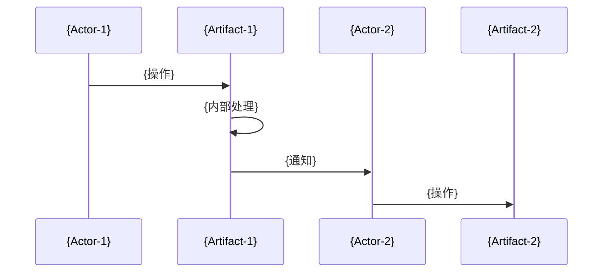

# {流程名称}

## Overview

**业务场景**：{描述，仅写已证实内容}

**参与产物**：{artifact-1} → {artifact-2} → {artifact-3}

**触发条件**：{什么情况下触发}

**成功标准**：{怎么算完成}

## Boundary & Confidence

### Confirmed Facts
- {已证实参与该流程的角色、产物、触发方式}

### Evidence-backed Inferences
- {基于调用链、事件、数据流可推断的流程边界；说明限制}

### To Verify
- {仍不确定的流程分支、外部系统责任边界、隐式参与者}

## Flow Diagram

## Stage Details

### Stage 1: {阶段名}

| 属性 | 值 |
|------|-----|
| 触发 | {trigger} |
| 执行者 | {actor} |
| 输入 | {input} |
| 输出 | {output} |
| 移交点 | {handoff to next stage} |

## Data Flow

| Data | From | To | Transform | Failure Impact |
|------|------|-----|-----------|----------------|
| {data} | {from} | {to} | {transform} | {impact} |

## Failure Propagation

| Failure At | Impact On | Propagation | Compensation |
|------------|-----------|-------------|--------------|
| {stage} | {impact} | {如何传播} | {补偿} |

## Related Artifacts

- [{artifact-1}](business/artifacts/{artifact-1}.md)
- [{artifact-2}](business/artifacts/{artifact-2}.md)
