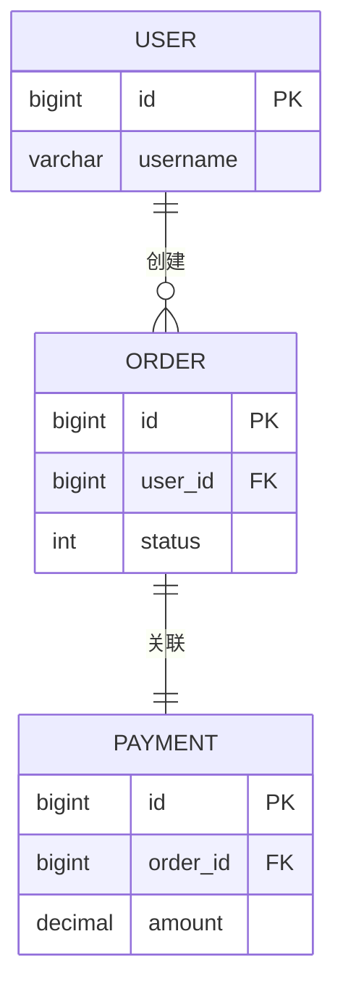

# 表关系矩阵

> 本文档汇总所有表/集合之间的关系，提供全局视图。
> **核心目标**：不仅记录物理外键/引用，更要挖掘**代码层面的隐式关联**和**业务规则驱动的关系约束**。
> 单表详情请查看 [tables/](tables/) 目录。

## 关系总览

| 统计项 | 数量 |
|--------|------|
| 总表数 | {N} |
| 物理外键/引用 | {M} |
| 隐式/逻辑关系 | {K} |
| 原子操作边界内关联 | {P} |
| 跨表业务不变量 | {Q} |

---

## 物理外键/引用关系

> 基于数据结构定义中的显式外键、引用字段或关联声明

### 完整关系表

| 源表/集合 | 关系 | 目标表/集合 | 关联字段 | 级联规则 | 代码位置 | 业务语义 |
|------|------|--------|----------|----------|----------|----------|
| [{table_a}](tables/{table_a}.md) | 1:N | [{table_b}](tables/{table_b}.md) | `{table_a_id}` | RESTRICT | `{文件路径}` | {说明} |

---

## 隐式关系（代码层面）

> **关键章节**：没有物理外键，但在代码中通过关联查询、ID 传递或应用层维护的关系。
> 这些关系往往蕴含更深层的业务耦合。

### 关联查询模式

| 主表 | 关联表 | 关联条件 | 典型场景 | 代码位置 |
|------|--------|-----------|----------|----------|
| `{table_a}` | `{table_b}, {table_c}` | `{table_a}.id = {table_b}.ref_a_id` | 列表查询 | `{文件路径}` |

### 应用层维护的关联

| 主表 | 逻辑关联表 | 关联方式 | 维护代码 | 业务说明 |
|------|-----------|---------|---------|---------|
| `{table_a}` | `{table_b}` | ID 传递/查询 | `{文件路径}` | {说明} |

---

## 原子操作边界内的跨表操作

> 哪些表必须在同一原子操作/事务内操作？失败时的一致性风险是什么？

| 主操作 | 伴随操作（同边界） | 操作入口 | 失败一致性风险 |
|--------|-------------------|---------|---------------|
| 创建 `{entity_a}` | 创建 `{entity_b}` + 更新 `{entity_c}` | `{文件路径}` | {风险说明} |

### 时序敏感的跨表操作

> 操作顺序错误会导致什么业务问题？

| 顺序 | 操作 A | 操作 B | 代码位置 | 顺序错误的影响 |
|------|--------|--------|---------|---------------|
| 必须 A→B | {操作A} | {操作B} | `{文件路径}` | {影响} |
| 禁止 A→B | {操作A} | {操作B} | `{文件路径}` | {影响} |

---

## 跨表业务不变量

> "什么数据状态必须同时为真" —— 跨越多张表的业务规则

| 不变量 | 涉及的表 | 约束来源 | 违背场景 | 违背影响 |
|--------|---------|----------|---------|---------|
| {描述} | `{table_a}` + `{table_b}` | `{文件路径}` | {场景} | {影响} |

### 示例格式
```markdown
| 审批通过必有扣款记录 | `t_order` + `t_bill` | `OrderService#approveOrder` 顺序执行 | 扣款抛异常但状态已改 | 已审批未扣款，对账差异 |
| 一公司一余额行 | `t_company` + `t_company_balance` | 运营数据假设 | 查询返回 null | 后续操作 NPE |
```

---

## 级联影响分析

### 创建级联

> 创建主表记录时，必定伴随创建哪些关联表记录？

| 主表 | 级联创建 | 创建条件 | 代码位置 |
|------|---------|---------|---------|
| `{table_a}` | `{table_b}, {table_c}` | {条件} | `{文件路径}` |

### 状态传播路径

> 主表状态变更会触发哪些关联表的操作？

```
{table_a} (状态变更: X → Y)
  ├── {table_b} → {操作}
  ├── {table_c} → {操作}
  └── {table_d} → {操作}
```

### 删除/作废影响

> 删除主表记录会影响哪些表？系统如何处理？

| 操作 | 主表 | 受影响表 | 处理策略 | 代码位置 |
|------|------|---------|---------|---------|
| 删除 | `{table_a}` | `{table_b}, {table_c}` | {策略} | `{文件路径}` |

---

## 关系拓扑图

### 核心 ER 图



### 业务级关系图

> 不仅展示外键，更展示**业务操作触发的关系流转**

```mermaid
graph TD
    A[{table_a}] -->|创建时级联| B[{table_b}]
    A -->|状态变更触发| C[{table_c}]
    B -->|关联查询| D[{table_d}]
    C -->|原子操作内一致| E[{table_e}]
```

---

## 关键业务查询路径

| 业务场景 | 涉及表 | 关联条件 | 代码位置 | 性能注意 |
|---------|-------|-----------|---------|---------|
| {场景} | {表列表} | {条件} | `{文件路径}` | {注意点} |

---

## 关系变更历史

| 日期 | 变更 | 涉及表 | 原因 |
|------|------|--------|------|
| YYYY-MM-DD | 新增外键 | `{table_a}` → `{table_b}` | {原因} |
