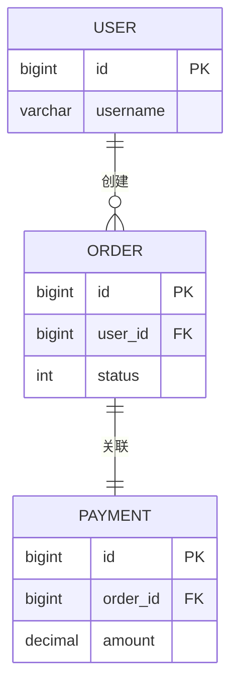

# 表关系矩阵

> 本文档汇总所有表之间的关系，提供全局视图。
> 单表详情请查看 [tables/](tables/) 目录。

## 关系总览

| 统计项 | 数量 |
|--------|------|
| 总表数 | {N} |
| 关系对数 | {M} |
| 1:1 关系 | {N} |
| 1:N 关系 | {M} |
| N:M 关系 | {K} |

## 关系矩阵

### 完整关系表

| 源表 | 关系 | 目标表 | 外键字段 | 级联规则 | 证据位置 | 业务说明 |
|------|------|--------|----------|----------|----------|----------|
| [{table_a}](tables/{table_a}.md) | 1:N | [{table_b}](tables/{table_b}.md) | `{table_a_id}` | RESTRICT | `{Class}#{method}()` | {说明} |
| [{table_a}](tables/{table_a}.md) | N:M | [{table_c}](tables/{table_c}.md) | 通过中间表 | CASCADE | DDL | {说明} |

### 按关系类型分组

#### 1:1 关系

| 表 A | 表 B | 关联字段 | 业务场景 |
|------|------|----------|----------|
| `{table_a}` | `{table_b}` | `{table_a}.id = {table_b}.{pk}` | {场景} |

#### 1:N 关系

| 父表 | 子表 | 外键 | 级联规则 |
|------|------|------|----------|
| `{parent}` | `{child}` | `{parent_id}` | {CASCADE/RESTRICT} |

#### N:M 关系（通过中间表）

| 表 A | 中间表 | 表 B | 业务含义 |
|------|--------|------|----------|
| `{table_a}` | `{table_a_b}` | `{table_b}` | {关系含义} |

## 关系拓扑图

### 核心 ER 图



### 完整关系图

```mermaid
graph TD
    A[{table_a}] -->|1:N| B[{table_b}]
    A -->|1:N| C[{table_c}]
    B -->|N:M| D[{table_d}]
    C -->|1:1| D
```

## 关键关系路径

### 业务查询常用路径

| 业务场景 | 表路径 | JOIN 顺序 | 典型查询 |
|----------|--------|-----------|----------|
| {场景} | {table_a} → {table_b} → {table_c} | {顺序} | `{Service}#{method}()` |

### 级联删除影响

| 删除表 | 受影响表 | 影响类型 | 处理策略 |
|--------|----------|----------|----------|
| `{table_a}` | `{table_b}, {table_c}` | 外键约束 | {阻止删除/级联删除/置空} |

## 隐式关系（代码层面）

> 没有外键约束，但在代码中通过 JOIN 或应用层维护的关系

| 表 A | 表 B | 关联方式 | 代码位置 | 业务说明 |
|------|------|----------|----------|----------|
| `{table_a}` | `{table_b}` | 逻辑外键 | `{Class}#{method}()` | {说明} |

## 关系变更历史

| 日期 | 变更 | 涉及表 | 原因 |
|------|------|--------|------|
| YYYY-MM-DD | 新增外键 | `{table_a}` → `{table_b}` | {原因} |
