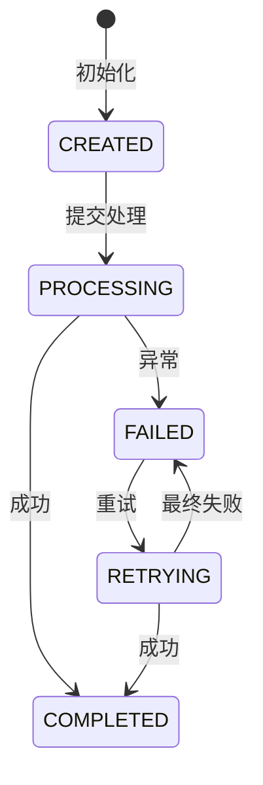
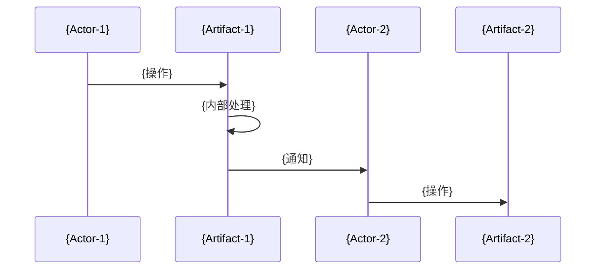
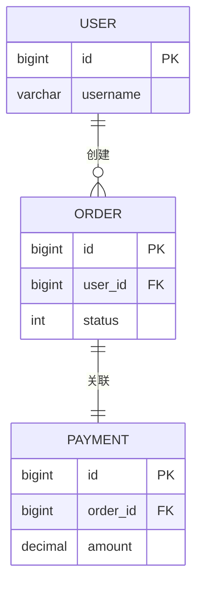
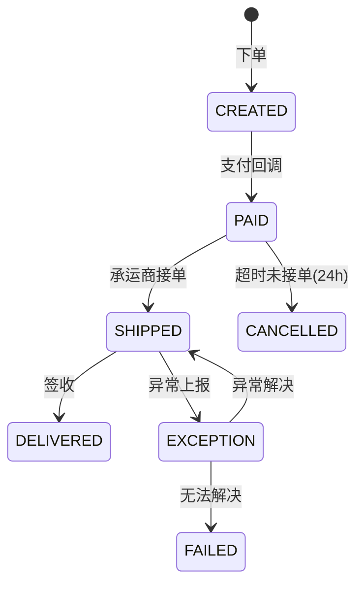

# LightCone 业务图谱 - 详细参考

深度业务图谱型记忆系统的完整规范、模板和示例。

---

## 1. 写作流程

### Phase 1: 全代码扫描（必须）

```bash
# 1. 识别所有相关代码文件
grep -r "{keyword}" --include="*.java" src/ | grep -v test

# 2. 找出状态枚举
grep -r "enum.*Status\|STATUS_" --include="*.java" src/

# 3. 找出数据库表
grep -r "@TableName\|CREATE TABLE" --include="*.java" --include="*.sql" src/ doc/

# 4. 找出核心 Service
grep -r "class.*Service" --include="*.java" src/main/java | grep -v impl

# 5. 找出消费者（调用方）
grep -r "{serviceName}\.{method}" --include="*.java" src/
```

### Phase 2: 深度挖掘

使用以下问题清单：

```markdown
## 深度挖掘检查清单

### 跨模块耦合
- [ ] 哪些模块读取此产物的数据？
- [ ] 哪些模块监听此产物的状态变化？
- [ ] 是否存在隐式契约（如"状态=X时必有字段Y"）？
- [ ] 修改此产物会影响哪些报表/统计/下游系统？

### 状态与生命周期
- [ ] 所有可能的状态值？
- [ ] 状态转换的触发条件？
- [ ] 每个状态转换的副作用（发送消息、调用API、更新其他表）？
- [ ] 是否存在终态？终态后还能做什么？
- [ ] 状态回退是否允许？什么场景？

### 时序与依赖
- [ ] 操作的必须顺序？
- [ ] 哪些操作可以并行？
- [ ] 哪些操作必须原子？
- [ ] 违反时序会导致什么业务问题？

### 失败场景
- [ ] 每个外部依赖的失败处理？
- [ ] 部分失败如何补偿？
- [ ] 是否存在无法自动恢复的状态？
- [ ] 人工介入的触发条件和流程？

### 数据一致性
- [ ] 哪些数据可能不一致？
- [ ] 不一致的检测方式？
- [ ] 不一致的修复方式？
- [ ] 业务能否接受暂时不一致？多久？
```

---

## 2. 文档模板

### 2.1 00-index.md 模板

```markdown
---
type: index
name: root
title: 项目入口
coverage: complete
last_verified: YYYY-MM-DD
confidence: high
---

# {项目名称} 业务图谱

## 一句话描述

{项目核心业务}

## 核心产物（Artifacts）

| 产物 | 业务目标 | 关键状态 | 文档位置 |
|------|----------|----------|----------|
| {artifact-1} | {解决什么问题} | {INIT → PROCESSING → DONE} | [business/artifacts/{artifact-1}.md](business/artifacts/{artifact-1}.md) |
| {artifact-2} | {解决什么问题} | {CREATED → PAID → SHIPPED} | [business/artifacts/{artifact-2}.md](business/artifacts/{artifact-2}.md) |

## 核心流程（Flows）

| 流程 | 涉及产物 | 业务场景 | 文档位置 |
|------|----------|----------|----------|
| {flow-1} | {artifact-1} → {artifact-2} | {端到端场景} | [business/flows/{flow-1}.md](business/flows/{flow-1}.md) |

## 快速导航

- **业务背景**：[`business/context.md`](business/context.md)
- **症状排查**：[`atlas/symptom.md`](atlas/symptom.md)
- **代码符号**：[`atlas/symbol.md`](atlas/symbol.md)
- **模块归属**：[`code/modules.md`](code/modules.md)

## 数据模型

- **Schema 总览**：[schema/overview.md](schema/overview.md)
- **表关系矩阵**：[schema/relations.md](schema/relations.md)
- **单表文档**：见 schema/tables/ 目录

## 阅读指南

1. **新接手项目**：context → 核心产物 → 核心流程 → Schema总览
2. **改代码**：定位产物 → 阅读 Deep Business Rules → 查看 Trace
3. **排查问题**：symptom索引 → 产物 Failure 章节
4. **理解数据模型**：Schema总览 → 单表文档 → 关系矩阵
```

### 2.2 business/artifacts/{artifact}.md 模板

```markdown
---
type: artifact
name: {artifact-id}
title: {业务名称}
coverage: complete
last_verified: YYYY-MM-DD
confidence: high
---

# {业务名称}

## Why Exists

**一句话定义**：{这个产物是什么}

**业务目标**：{解决谁的什么问题}

**失败影响**：{失败时影响什么业务}

**无影响范围**：{失败时不影响什么，可降级}

## Lifecycle

### Stages（阶段矩阵）

| Stage | Trigger | Actor | Input | Processing | Output | Persist | Next Consumer |
|-------|---------|-------|-------|------------|--------|---------|---------------|
| {stage-1} | {trigger} | {actor} | {input} | {processing} | {output} | {persist} | {consumer} |
| {stage-2} | {trigger} | {actor} | {input} | {processing} | {output} | {persist} | {consumer} |

### Data Flow（数据流矩阵）

| Data | Source | Transform | Stored | Exposed Via | Consumed By | Failure Impact |
|------|--------|-----------|--------|-------------|-------------|----------------|
| {data-1} | {source} | {transform} | {stored} | {exposed} | {consumer} | {impact} |

### State Machine（状态机）



**状态说明**：

| State | Meaning | Allowed Transitions | Business Rule |
|-------|---------|---------------------|---------------|
| {state} | {含义} | {可转换到} | {约束} |

## Deep Business Rules ★

### Cross-Module Constraints（跨模块约束）

```
约束1: {模块A} 依赖 {模块B} 的 {条件}
- 场景: {什么情况下}
- 风险: {违反时发生什么}
- 代码位置: {file:line}
```

### Implicit Dependencies（隐式依赖）

```
依赖1: {字段} 实际由 {X} 维护，{Y} 直接读取
- 假设: {Y} 假设 {条件}
- 违反场景: {什么情况}
- 后果: {会发生什么}
```

### Business Invariants（业务不变量）

| Invariant | Enforced By | Violation Scenario | Impact | Detection |
|-----------|-------------|-------------------|--------|-----------|
| {规则} | {谁保证} | {什么情况下} | {后果} | {如何发现} |

### Temporal Rules（时序规则）

| Order | Operation A | Operation B | Violation Impact | Enforced By |
|-------|-------------|-------------|------------------|-------------|
| MUST  | {操作A} | {操作B} | {后果} | {机制} |
| MUST_NOT | {操作A} | {操作B} | {后果} | {机制} |

## Trace（代码追踪）

### Core Call Chain

```
{EntryPoint}
  → {Method1}() [{事务边界}]
    → {Method2}() [副作用: {说明}]
    → {Method3}() [异步: {说明}]
  → [{事务提交/结束}]
  → {AsyncHandler}()
```

### Transaction & Async Boundaries

| Method | Type | Notes |
|--------|------|-------|
| `{method}()` | Transactional | 回滚范围: {说明} |
| `{method}()` | Async | 线程池: {pool}, 超时: {time} |
| `{method}()` | External API | 超时: {time}, 重试: {yes/no} |

### Side Effects（副作用顺序）

| Order | Effect | Trigger | Compensate On Failure |
|-------|--------|---------|----------------------|
| 1 | {副作用} | {触发点} | {补偿方式} |

### Dangerous Change Points

| Location | Current Logic | Risk If Changed | Validation Rule |
|----------|---------------|-----------------|-----------------|
| `{ClassName}#{method}({ParamType})` | {当前逻辑} | {改动风险} | {必须遵守的规则} |

## Failure & Degradation

| Scenario | Behavior | Business Impact | Recovery | Related Code |
|----------|----------|-----------------|----------|--------------|
| {场景} | {表现} | {影响} | {恢复} | {代码位置} |

## Evidence Anchors

### Core Classes
- `{ClassName}`: `{package}/{ClassName}.java`

### Enums
- `{StatusEnum}`: `{package}/{StatusEnum}.java`

### DB Tables
- `{table}`: `{ddl-file}.sql`

### Key Methods
- `{ClassName}#{method}({ParamType})` — {核心逻辑描述}

## Related

- **Flows**: [{flow}](business/flows/{flow}.md)
- **Related Artifacts**: [{artifact}](business/artifacts/{artifact}.md)
```

### 2.3 business/flows/{flow}.md 模板

```markdown
---
type: flow
name: {flow-id}
title: {流程名称}
coverage: complete
last_verified: YYYY-MM-DD
confidence: high
---

# {流程名称}

## Overview

**业务场景**：{描述}

**参与产物**：{artifact-1} → {artifact-2} → {artifact-3}

**触发条件**：{什么情况下触发}

**成功标准**：{怎么算完成}

## Flow Diagram



## Stage Details

### Stage 1: {阶段名}

| 属性 | 值 |
|------|-----|
| 触发 | {trigger} |
| 执行者 | {actor} |
| 输入 | {input} |
| 输出 | {output} |
| 移交点 | {handoff to next stage} |

## Data Flow

| Data | From | To | Transform | Failure Impact |
|------|------|-----|-----------|----------------|
| {data} | {from} | {to} | {transform} | {impact} |

## Failure Propagation

| Failure At | Impact On | Propagation | Compensation |
|------------|-----------|-------------|--------------|
| {stage} | {impact} | {如何传播} | {补偿} |

## Related Artifacts

- [{artifact-1}](business/artifacts/{artifact-1}.md)
- [{artifact-2}](business/artifacts/{artifact-2}.md)
```

### 2.4 business/context.md 模板

```markdown
---
type: context
name: context
title: 项目背景
coverage: complete
last_verified: YYYY-MM-DD
confidence: high
---

# 项目背景

## Business Domain

**行业**：{行业}

**核心业务**：{一句话}

**目标用户**：{用户}

## Scope Boundary

### In Scope
- {范围内}

### Out of Scope
- {范围外}

## Core Terminology

| 术语 | 英文 | 含义 | 示例 |
|------|------|------|------|
| {术语} | {english} | {含义} | {示例} |

## Architecture Overview

```
[External] → [Controller] → [Service] → [Mapper] → [DB]
                ↓
            [External API]
```

## Tech Stack

- {技术}: {版本}

## Related Systems

| System | Relation | Protocol | Purpose |
|--------|----------|----------|---------|
| {系统} | {关系} | {协议} | {目的} |
```

### 2.5 atlas/keyword.md 模板

```markdown
---
type: index
name: keyword
title: 关键词索引
coverage: complete
last_verified: YYYY-MM-DD
confidence: high
---

# 关键词索引

| Key | Kind | Target | Notes |
|-----|------|--------|-------|
| {关键词} | 业务词 | [business/artifacts/{X}.md](business/artifacts/{X}.md) | {说明} |
| {关键词} | 产物名 | [business/artifacts/{X}.md](business/artifacts/{X}.md) | {说明} |
| {关键词} | 状态 | [business/artifacts/{X}.md](business/artifacts/{X}.md) #{章节} | {说明} |
| {关键词} | 角色 | [business/artifacts/{X}.md](business/artifacts/{X}.md) | {说明} |
```

### 2.6 atlas/symbol.md 模板

```markdown
---
type: index
name: symbol
title: 代码符号索引
coverage: complete
last_verified: YYYY-MM-DD
confidence: high
---

# 代码符号索引

## Classes

| Symbol | Kind | Artifact | Location |
|--------|------|----------|----------|
| `{ClassName}` | Service | [{artifact}](business/artifacts/{artifact}.md) | `{package}/{ClassName}.java` |

## Methods

| Symbol | Artifact | Location | Purpose |
|--------|----------|----------|---------|
| `{ClassName}#{method}({ParamType})` | [{artifact}](business/artifacts/{artifact}.md) | `{ClassName}#{method}({ParamType})` | {用途} |

## Tables

### 表归属

| Symbol | Primary Artifact | Schema Doc | Description |
|--------|------------------|------------|-------------|
| `{table}` | [{artifact}](business/artifacts/{artifact}.md) | [schema/tables/{table}.md](schema/tables/{table}.md) | {描述} |

### 表关系快速索引

| 表 A | 关系 | 表 B | 关联方式 | Schema 文档 |
|------|------|------|----------|-------------|
| {table_a} | 1:N | {table_b} | {foreign_key} | [relations.md](schema/relations.md) |
```

### 2.7 atlas/symptom.md 模板

```markdown
---
type: index
name: symptom
title: 症状索引
coverage: complete
last_verified: YYYY-MM-DD
confidence: high
---

# 症状索引

| Symptom | Possible Root Cause | Target Doc | Section |
|---------|---------------------|------------|---------|
| {错误现象} | {根因} | [business/artifacts/{X}.md](business/artifacts/{X}.md) | Failure |
| {异常信息} | {根因} | [business/artifacts/{X}.md](business/artifacts/{X}.md) | Trace |
```

### 2.8 code/modules.md 模板

```markdown
---
type: module
name: modules
title: 模块归属
coverage: complete
last_verified: YYYY-MM-DD
confidence: high
---

# 模块归属

## 按包结构

| Package | Primary Artifact | Related Flows | Notes |
|---------|------------------|---------------|-------|
| `{package}` | [{artifact}](business/artifacts/{artifact}.md) | [{flow}](business/flows/{flow}.md) | {说明} |

## 按技术层

| Layer | Classes | Purpose |
|-------|---------|---------|
| Controller | {classes} | {purpose} |
| Service | {classes} | {purpose} |
| Mapper | {classes} | {purpose} |
```

### 2.9 schema/overview.md 模板

```markdown
---
type: schema-overview
name: schema-overview
title: 数据库 Schema 总览
coverage: stub
last_verified: YYYY-MM-DD
confidence: low
db_type: MySQL
version: "8.0"
---

# {数据库名称} Schema 总览

## 数据库信息

| 属性 | 值 |
|------|-----|
| 数据库类型 | {MySQL/PostgreSQL/Oracle/etc} |
| 版本 | {版本号} |
| 字符集 | {utf8mb4/etc} |
| 表数量 | {N} |

## 核心表清单

| 表名 | 主要业务产物 | 行数估计 | 核心字段 | Schema 文档 |
|------|-------------|----------|----------|-------------|
| `{table_name}` | [{artifact}](business/artifacts/{artifact}.md) | {规模} | {id, status, user_id} | [tables/{table_name}.md](tables/{table_name}.md) |

## ER 图

```mermaid
erDiagram
    {TABLE_A} ||--o{ TABLE_B : "外键关系"
    {TABLE_A} {
        bigint id PK
        varchar name
        int status
    }
    {TABLE_B} {
        bigint id PK
        bigint table_a_id FK
        timestamp created_at
    }
```

> **说明**：ER 图只显示核心表和关键关系。详细的字段信息请查看各表的独立文档。

## 关键关系说明

| 关系 | 类型 | 业务含义 | 级联规则 |
|------|------|----------|----------|
| `{table_a}.{fk_col}` → `{table_b}.{pk_col}` | {1:1/1:N/N:M} | {业务含义} | {CASCADE/SET NULL/RESTRICT} |

## Schema 变更历史

| 日期 | 变更类型 | 表/字段 | 变更内容 | 相关需求 |
|------|----------|---------|----------|----------|
| YYYY-MM-DD | ADD | {table}.{column} | {新增字段} | {需求背景} |

## 数据流概览

```
[用户操作] → [表 A] → [表 B] → [下游系统]
                ↓
            [关联表 C]
```

> 详细的业务数据流请查看 [business/flows/](business/flows/) 目录。
```

### 2.10 schema/tables/{table}.md 模板

```markdown
---
type: schema-table
name: {table-name}
title: {表中文名}
coverage: stub
last_verified: YYYY-MM-DD
confidence: low
primary_artifact: {artifact-name}
---

# {表名} ({表中文名})

## 表基础信息

| 属性 | 值 |
|------|-----|
| 表名 | `{table_name}` |
| 引擎 | {InnoDB/MyISAM/etc} |
| 字符集 | {utf8mb4/etc} |
| 主要业务产物 | [{artifact}](business/artifacts/{artifact}.md) |
| 数据规模 | {预估行数/增长趋势} |

## DDL / ORM 定义

### 来源

- **DDL 文件**: `{path/to/ddl.sql}`
- **ORM 实体类**: `{package/EntityClass.java}`
- **迁移脚本**: `{migration/V001__create_table.sql}`

### 原始 DDL

```sql
CREATE TABLE `{table_name}` (
  `id` bigint NOT NULL AUTO_INCREMENT,
  `status` int NOT NULL DEFAULT '0',
  `created_at` timestamp NOT NULL DEFAULT CURRENT_TIMESTAMP,
  PRIMARY KEY (`id`),
  KEY `idx_status` (`status`)
) ENGINE=InnoDB DEFAULT CHARSET=utf8mb4;
```

### ORM 注解（如果是 JPA/MyBatis）

```java
@Entity
@Table(name = "{table_name}")
public class {EntityClass} {
    @Id
    @GeneratedValue(strategy = GenerationType.IDENTITY)
    private Long id;

    @Column(nullable = false, columnDefinition = "int default 0")
    private Integer status;
}
```

## 字段详解

| 字段名 | 类型 | 可空 | 默认 | 业务含义 | 示例值 | 备注 |
|--------|------|------|------|----------|--------|------|
| `id` | bigint | NO | AUTO_INCREMENT | 主键 ID | 12345 | 自增 |
| `status` | int | NO | 0 | 状态码 | 1=CREATED, 2=PAID | 见状态枚举定义 |
| `created_at` | timestamp | NO | CURRENT_TIMESTAMP | 创建时间 | 2024-03-14 10:30:00 | 自动填充 |

### 字段业务规则

| 字段 | 业务规则 | 证据位置 |
|------|----------|----------|
| `{field}` | {规则描述，如"必须是已存在的用户ID"} | `{ClassName}#method(ParamType)` |

## 索引

| 索引名 | 类型 | 字段 | 用途 | 备注 |
|--------|------|------|------|------|
| `PRIMARY` | 主键 | `id` | 唯一标识 | - |
| `idx_status` | 普通 | `status` | 状态查询 | 常用于 WHERE status=? |
| `uk_{field}` | 唯一 | `{field}` | 业务唯一约束 | - |

## 关联表

### 外键关系（本表引用其他表）

| 本表字段 | 关联表 | 关联字段 | 关系类型 | 级联规则 | 业务含义 |
|----------|--------|----------|----------|----------|----------|
| `{fk_column}` | [{table_b}]({table_b}.md) | `id` | {N:1} | {RESTRICT} | {含义} |

### 被引用关系（其他表引用本表）

| 引用表 | 引用字段 | 本表字段 | 关系类型 | 业务影响 |
|--------|----------|----------|----------|----------|
| [{table_c}]({table_c}.md) | `{table_a_id}` | `id` | {1:N} | {删除时需检查} |

### JOIN 查询模式

```java
// 典型的关联查询模式
SELECT a.*, b.name
FROM {table_a} a
JOIN {table_b} b ON a.{fk_col} = b.id
WHERE a.status = ?
```

## 业务规则推断

### 从表结构推断的约束

| 规则 | 推断依据 | 业务含义 |
|------|----------|----------|
| `{规则名}` | `{字段}+非空约束` | {业务含义} |

### 状态字段说明（如果有）

| 状态值 | 含义 | 允许转换到 | 触发条件 |
|--------|------|------------|----------|
| 0 | INIT | 1, 2 | 初始化 |
| 1 | CREATED | 2 | 创建完成 |
| 2 | COMPLETED | - | 处理完成 |

## 证据锚点

- **DDL 文件**: `{path/to/ddl.sql}`
- **ORM 实体**: `{package/EntityClass.java}`
- **Mapper 接口**: `{package/MapperClass.java}`
- **核心业务查询**: `{ServiceClass}#{queryMethod}({ParamType})` — {用途}
- **关联业务产物**: [business/artifacts/{artifact}.md](business/artifacts/{artifact}.md)
```

### 2.11 schema/relations.md 模板

```markdown
---
type: schema-relations
name: schema-relations
title: 表关系矩阵
coverage: stub
last_verified: YYYY-MM-DD
confidence: low
table_count: 0
relation_count: 0
---

# 表关系矩阵

> 本文档汇总所有表之间的关系，提供全局视图。
> 单表详情请查看 [tables/](tables/) 目录。

## 关系总览

| 统计项 | 数量 |
|--------|------|
| 总表数 | {N} |
| 关系对数 | {M} |
| 1:1 关系 | {N} |
| 1:N 关系 | {M} |
| N:M 关系 | {K} |

## 关系矩阵

### 完整关系表

| 源表 | 关系 | 目标表 | 外键字段 | 级联规则 | 证据位置 | 业务说明 |
|------|------|--------|----------|----------|----------|----------|
| [{table_a}](tables/{table_a}.md) | 1:N | [{table_b}](tables/{table_b}.md) | `{table_a_id}` | RESTRICT | `{Class}#{method}()` | {说明} |
| [{table_a}](tables/{table_a}.md) | N:M | [{table_c}](tables/{table_c}.md) | 通过中间表 | CASCADE | DDL | {说明} |

### 按关系类型分组

#### 1:1 关系

| 表 A | 表 B | 关联字段 | 业务场景 |
|------|------|----------|----------|
| `{table_a}` | `{table_b}` | `{table_a}.id = {table_b}.{pk}` | {场景} |

#### 1:N 关系

| 父表 | 子表 | 外键 | 级联规则 |
|------|------|------|----------|
| `{parent}` | `{child}` | `{parent_id}` | {CASCADE/RESTRICT} |

#### N:M 关系（通过中间表）

| 表 A | 中间表 | 表 B | 业务含义 |
|------|--------|------|----------|
| `{table_a}` | `{table_a_b}` | `{table_b}` | {关系含义} |

## 关系拓扑图

### 核心 ER 图



### 完整关系图

```mermaid
graph TD
    A[{table_a}] -->|1:N| B[{table_b}]
    A -->|1:N| C[{table_c}]
    B -->|N:M| D[{table_d}]
    C -->|1:1| D
```

## 关键关系路径

### 业务查询常用路径

| 业务场景 | 表路径 | JOIN 顺序 | 典型查询 |
|----------|--------|-----------|----------|
| {场景} | {table_a} → {table_b} → {table_c} | {顺序} | `{Service}#{method}()` |

### 级联删除影响

| 删除表 | 受影响表 | 影响类型 | 处理策略 |
|--------|----------|----------|----------|
| `{table_a}` | `{table_b}, {table_c}` | 外键约束 | {阻止删除/级联删除/置空} |

## 隐式关系（代码层面）

> 没有外键约束，但在代码中通过 JOIN 或应用层维护的关系

| 表 A | 表 B | 关联方式 | 代码位置 | 业务说明 |
|------|------|----------|----------|----------|
| `{table_a}` | `{table_b}` | 逻辑外键 | `{Class}#{method}()` | {说明} |

## 关系变更历史

| 日期 | 变更 | 涉及表 | 原因 |
|------|------|--------|------|
| YYYY-MM-DD | 新增外键 | `{table_a}` → `{table_b}` | {原因} |
```

---

## 3. 好 vs 坏 示例

### Bad：信息密度低，只有表面描述

```markdown
# 订单

订单是系统的核心模块。

## 生命周期

1. 创建订单
2. 支付订单
3. 发货
4. 完成

## 相关代码

- OrderService
- OrderMapper
```

### Good：高信息密度，包含深度业务规则

```markdown
---
type: artifact
name: order
title: 物流订单
coverage: complete
last_verified: 2024-03-14
confidence: high
---

# 物流订单

## Why Exists

**一句话定义**：客户委托平台完成货物运输的契约凭证

**业务目标**：承载从下单到签收的全流程状态，连接客户、运营、财务、承运商四方

**失败影响**：订单丢失=客户无法跟踪货物+财务无法结算+客服无法响应查询

**无影响范围**：订单查询失败不影响正在执行的运输任务（承运商侧独立运行）

## Lifecycle

### Stages

| Stage | Trigger | Actor | Input | Processing | Output | Persist | Next Consumer |
|-------|---------|-------|-------|------------|--------|---------|---------------|
| CREATED | 客户下单 | OrderService | QuoteResult+Address+SKU | 校验报价有效性+库存预留 | 订单记录 | t_order.status=CREATED | 支付系统 |
| PAID | 支付回调 | PaymentService | PaymentRecord | 确认款项+推送承运商 | 扣款凭证+运单号申请 | t_order.status=PAID, t_payment | 承运商接口 |
| SHIPPED | 承运商回调 | CarrierCallback | TrackingNo+PickupTime | 更新轨迹起始信息 | 可跟踪状态 | t_order.status=SHIPPED, t_tracking | 客户通知系统 |
| DELIVERED | 签收回调 | CarrierCallback | DeliveryTime+Signee | 确认完成+生成账单 | 完成凭证 | t_order.status=DELIVERED, t_bill | 财务系统 |

### State Machine



**关键约束**：
- PAID 后 24h 未转 SHIPPED 自动取消退款（防止承运商挂起）
- EXCEPTION 状态超过 72h 必须人工介入（自动重试已耗尽）

## Deep Business Rules ★

### Cross-Module Constraints

1. **财务结算依赖订单终态，但终态变更是异步的**
   - 场景：定时任务扫描 DELIVERED 订单生成账单
   - 风险：订单刚变 DELIVERED 时若立即查询，可能因事务未提交而漏单
   - 缓解：账单任务扫描 `update_time > {last_scan} - 5min` 的窗口

2. **客服查询直接读主库，运营报表读从库**
   - 隐式契约：客服响应速度优先，容忍5秒内数据延迟
   - 运营报表可容忍分钟级延迟

### Implicit Dependencies

1. **order.trackingNo 由承运商异步回调写入**
   - 假设：查询接口假设 trackingNo 非空（SHIPPED 后）
   - 违反场景：承运商回调延迟，客户已看到 SHIPPED 但 trackingNo 为空
   - 后果：客户端 NPE（历史事故 #2342）
   - 当前处理：查询接口做空值兜底，显示 "物流信息同步中"

### Business Invariants

| Invariant | Enforced By | Violation Scenario | Impact | Detection |
|-----------|-------------|-------------------|--------|-----------|
| `status=PAID → payment_record exists` | PaymentCallback | 回调重复触发 | 重复扣款 | 对账时发现单边账 |
| `status=SHIPPED → tracking_no != null` | CarrierCallback | 承运商返回空单号 | 无法跟踪 | 定时扫描检测 |
| `status=DELIVERED → actual_delivery_time != null` | StatusTransition | 手动改库 | 账期计算错误 | 数据校验任务 |

### Temporal Rules

| Order | Operation A | Operation B | Violation Impact | Enforced By |
|-------|-------------|-------------|------------------|-------------|
| MUST | 扣款 | 推送承运商 | 承运商已接单但款未扣，坏账 | 事务包裹 @OrderService.createShipment |
| MUST_NOT | 取消订单 | 推送承运商后 | 承运商已产生成本，取消无效 | 状态检查 @OrderService.cancel |
| MUST | 生成账单 | 结算打款 | 先打款后生成账单，无法追溯 | 账单审批流 @FinanceService |

## Trace

### Core Call Chain

```
OrderController.create()
  → OrderService.createOrder() [TX: REQUIRED]
    → OrderValidator.validateQuote() [报价有效性]
    → InventoryService.reserve() [副作用: 预留库存]
    → OrderMapper.insert() [订单入库]
  → PaymentService.charge() [TX: REQUIRES_NEW]
    → 外部支付接口 [异步: 支付结果回调]
  → CarrierService.submit() [TX: 独立]
    → 承运商API [超时: 30s, 重试: 3次]
```

### Transaction Boundaries

| Method | Boundary | Notes |
|--------|----------|-------|
| `OrderService.createOrder()` | TX 内 | 包含库存预留，失败回滚 |
| `PaymentService.charge()` | 独立 TX | 即使订单后续失败，支付记录保留用于退款 |
| `CarrierService.submit()` | TX 外 | 异步执行，失败进入重试队列 |

### Async Boundaries

| Event | Producer | Consumer | Delay | Failure |
|-------|----------|----------|-------|---------|
| payment.completed | PaymentCallback | OrderStatusUpdater | ~1s | 进死信队列，人工处理 |
| shipment.submitted | OrderService | CarrierAdapter | ~0s | 重试3次后告警 |

### Dangerous Change Points

| Location | Current Logic | Risk If Changed | Validation |
|----------|---------------|-----------------|------------|
| `OrderService#cancel(Long)` | 检查 `status ∈ [CREATED, PAID]` | 若允许取消 SHIPPED，承运商成本无人承担 | 必须保持状态检查 |
| `OrderMapper#updateStatus` | 使用乐观锁 | 若改为直接更新，并发状态覆盖 | 必须保持 version 字段 |

## Failure & Degradation

| Scenario | System Behavior | Business Impact | Recovery |
|----------|-----------------|-----------------|----------|
| 支付回调超时 | 订单保持 CREATED，15min后超时取消 | 客户需重新下单 | 自动退款，客户通知 |
| 承运商API故障 | 订单PAID但无法提交，进重试队列(5min间隔) | 发货延迟 | 自动重试，超24h人工介入 |
| 签收回调丢失 | 订单保持SHIPPED，48h后自动结单 | 实际已签收但系统未结 | 人工确认后补回调 |
| 库存预留失败 | 订单创建失败，返回错误 | 客户无法下单 | 客户重试或联系运营 |

## Evidence Anchors

- **OrderService**: `com.efficross.web.service.order.OrderService`
- **OrderStatus Enum**: `com.efficross.web.model.enums.OrderStatus`
- **DB Table**: `t_order` (DDL: `.cursor/mysql-ddl/order.sql`)
- **状态机校验**: `OrderService#validateStatusTransition(Long, OrderStatus)` — 校验状态转换合法性，违反时抛 BizException
```

---

## 5. 质量检查清单

在标记文档为 `coverage: complete` 前，必须检查：

### 基础完整性
- [ ] 包含 Frontmatter，所有字段已填
- [ ] 包含 Why Exists 章节
- [ ] 包含 Lifecycle 章节（Stages 表格 + Data Flow 表格）
- [ ] 包含 Trace 章节（调用链 + 事务边界）
- [ ] 包含 Failure & Degradation 章节
- [ ] 包含 Evidence Anchors（代码位置）

### 深度业务规则 ★
- [ ] 至少识别 1 个跨模块约束
- [ ] 至少识别 1 个隐式依赖
- [ ] 至少列出 2 个业务不变量
- [ ] 至少列出 2 条时序规则
- [ ] 所有规则都关联到具体代码位置（使用方法签名 `ClassName#method(ParamType)` 而非行号）

### 信息密度
- [ ] 没有纯方法名列举而无业务说明
- [ ] 没有纯状态列表而无转换规则
- [ ] 没有纯流程步骤而无输入输出
- [ ] 每个表格都有明确的业务含义
