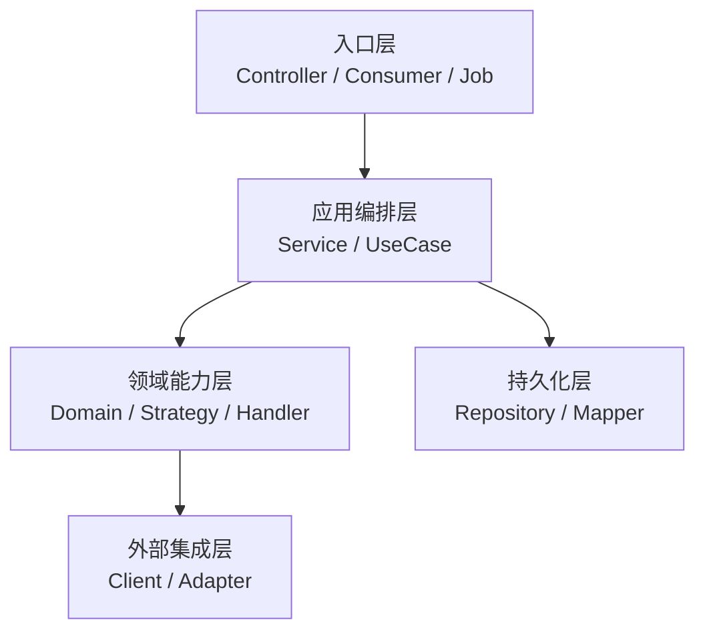
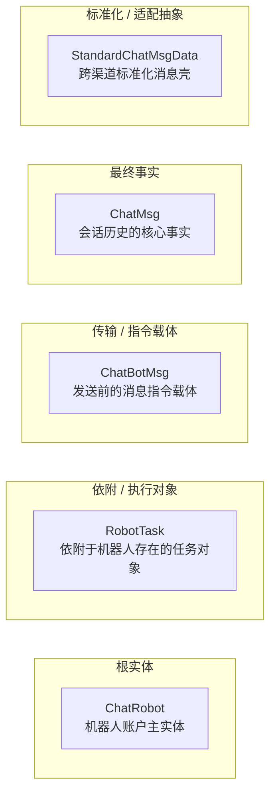

# 项目 README 开发者导读写作技能

这个技能只做一件事：**把仓库理解结果整理成一份适合放在根目录的开发者 README。**

目标不是写业务 PRD，也不是写逐类逐方法的代码说明书，而是让第一次接触项目的程序员尽快回答下面几个问题：

- 这个仓库在整个系统里承担什么职责，边界在哪里
- 它是如何运行起来的：入口、调度方式、外部依赖和持久化位置是什么
- 代码按哪些包领域 / 模块分层，每层负责什么，不负责什么
- 核心对象是谁生产、谁消费、谁改变状态
- 一条主链路按什么先后顺序推进
- 新同学接手时应该先读哪些入口和包域

如果仓库已经有 `README.md`，默认做 **增强式重构**，保留有价值内容，不直接推倒重写。

## 适用场景

- 用户要新建项目 README
- 用户要重构、补强、精简现有 README
- 用户想补充“代码架构 / 包域划分 / 模块边界 / 对象流转 / 生命周期 / 新人上手”
- 用户说“这个 README 看完还是不知道代码怎么接手”
- 用户希望从开发者视角沉淀项目总览文档
- 用户希望 README 解释“谁生产、谁消费、先看哪里、边界在哪里”

## 不适用场景

- 只写接口字段、请求响应示例的 API 文档
- 只写部署步骤、运维参数、环境变量说明
- 只做某一个模块的详细设计文档
- 需要逐行解释代码实现细节
- 需要跨仓库、跨上下游做完整业务归因的深度研究报告

这些内容可以存在于仓库里，但不应该占据根目录 README 的主轴。

## 第一原则

- README 先回答“这个仓库是什么、直接拥有哪部分能力、代码如何分层”，再回答“主链路如何运转”，最后补启动、配置、接口等工程细节
- 优先讲 **代码架构与模块边界**，业务背景只服务于解释代码为什么这样分层
- 在 `### 1` 和 `### 2` 里，必须先建立开发者心智模型：仓库定位、运行形态、核心包域、主对象、主链路
- 只写架构层与模块边界，不写类、方法、SQL、字段校验细节
- 信息要能支撑新人快速参与开发，而不是堆满业务名词或目录名
- 图和表都要短，默认只保留最关键的一层
- 结论强度不能超过证据强度
- 先写“代码和现有文档已经证明了什么”，再写“基于证据可做的保守判断”
- 目录名、类名、DTO 字段、注释、行业术语只能作为线索，不能单独证明项目定位、系统边界或完整业务域
- 包域划分、运行入口、主链路、对象流转是开发者 README 的主叙事，不要后置到附录
- 启动命令、环境变量、接口地址、Topic 清单等操作细节可以后置
- 判断不清时，优先使用更中性的定位句；必要时只补 1-2 行待确认说明，不把 README 写成审计报告

## 开始前先判断 README 主轴

先判断这个 README 应该采用哪种开发者导读主轴。类型只影响叙事重心，不要把它写成模板分类标签。

### 1. 应用服务型

适用于 Spring Boot / Node 服务、后台系统、定时任务服务、消息消费服务等有明确运行进程的仓库。

主轴优先级：

1. 仓库定位与运行形态
2. 入口与主链路
3. 包领域 / 模块边界
4. 核心对象生产消费关系
5. 生命周期或状态推进
6. 新人阅读顺序

### 2. 能力平台 / SDK 型

适用于框架、SDK、平台能力层、中间件、脚手架、通用组件等仓库。

主轴优先级：

1. 能力边界与接入方式
2. 使用方如何调用
3. 扩展点与内部模块分层
4. 输入、输出与状态变化
5. 典型开发入口

### 3. 多模块 / 聚合工程型

适用于 Maven 多模块、Monorepo、前后端聚合、多个子服务共仓等结构。

主轴优先级：

1. 子模块职责地图
2. 模块间依赖方向
3. 运行单元与共享单元的区分
4. 关键对象跨模块如何流转
5. 各模块的接手入口

### 4. 暂未定型 / 证据不足

当定位不清时，不要强行包装成完整业务系统。优先写成：

- 当前代码显示它直接拥有的能力
- 入口、持久化、外部调用这些可证实事实
- 主要包域和模块边界
- 待确认的业务上下游关系

判断规则：

- 先看启动入口、构建文件、Controller / Job / Consumer / CLI、配置装配，再看目录名和业务术语
- 如果去掉命名暗示后，项目定位仍然成立，才使用较强定性
- 如果项目既像业务系统又像集成适配层，优先从“本仓库直接拥有的代码能力”描述，不替其它系统补全业务闭环
- 当 README 主轴依赖关键边界判断但证据不足时，先补问 1 个问题；如果用户暂时无法补充，就采用更中性的表述

## 信息收集与探索优先级

先按优先级收集能决定开发者 README 主轴的信息，不要一上来就沉进业务细节或底层工具类：

| 优先级 | 目标 | 读什么 |
|--------|------|--------|
| 1 | 仓库定位与运行形态 | 现有 `README.md`、根构建文件、启动类、入口脚本、Docker / CI 配置 |
| 2 | 运行入口和触发方式 | Controller、Job、Consumer、RPC、CLI、WebSocket、Scheduler |
| 3 | 包领域 / 模块边界 | 顶层包、子模块、核心 service、domain、adapter、client、repository |
| 4 | 主链路顺序 | 从入口到核心服务、持久化、外部调用、结果返回的最短可解释路径 |
| 5 | 核心对象与状态 | Entity、Domain Model、DTO、Event、Task、Command、Record、Context |
| 6 | 外部依赖与消费方 | Feign / client、MQ、DB、Redis、OSS、第三方 SDK、下游通知 |
| 7 | 新人入口 | 最常改动的包、典型功能入口、已有测试、Swagger / API 文档 |

补充规则：

- 命名只能作为辅助线索，不能替代项目文档、入口、主流程和模块协作证据
- 如果项目很大，先找“贯穿全链路的入口”和“核心包域分层”，不要先读最底层工具类
- 在能说明“入口是什么、对象怎么流、模块怎么分工”之前，不要开始写正文
- 不要求把所有业务背景讲完整；README 的边界是帮助开发者接手代码，深层业务可留给二次提问或深度研究

## 写正文前必须先完成候选结论审查

在信息收集完毕后、第一段正文落笔前，**必须**先完成下面这些结论的审查，再开始写正文：

- 项目定位
- 运行形态
- 包领域 / 模块边界
- 主链路顺序
- 核心对象
- 核心对象的生产者与消费者
- 生命周期或状态推进方式
- 对外系统关系

先整理一个轻量表：

| 候选结论 | 证据类型 | 当前判断 | README 写法 |
|---------|----------|----------|-------------|
| `{结论}` | 直接证据 / 弱线索 | 可直接写 / 需保守改写 / 暂不写入 | 主结论 / 保守表述 / 待确认说明 |

证据判断规则：

- **直接证据**：现有 README、架构文档、启动入口、主流程调用链、核心模块协作、状态流转、核心持久化、运行配置
- **弱线索**：目录名、包名、类名、DTO 字段、注释、第三方协议名、单个 client / adapter / controller

审查规则：

1. **事实审查**
    - 如果去掉命名暗示后，这个结论仍然成立，才可以保留较强表述
    - 只有弱线索时，不能直接写“本系统就是某类完整业务系统”或“该模块负责完整业务域”

2. **边界审查**
    - 我写的是“本仓库直接拥有的能力”，还是“本仓库对接 / 适配 / 消费的外部能力”？
    - 我是不是把外部系统术语、回调协议、DTO 命名误写成了内部业务边界？
    - 我是不是把某个局部模块写成了整个系统的主线？

3. **反向否证**
    - 如果同时存在激进解释和保守解释，优先选择保守解释
    - 证据不足但又影响读者理解时，只补 1-2 行待确认说明；如果不影响主线，宁可不写

4. **叙事顺序审查**
    - `### 1` 和 `### 2` 的首句应该先让读者知道“仓库职责、运行形态、主链路、核心包域”
    - 如果目前只能列目录，还说不清包域边界和对象流转，先回去补判断，不要直接落正文

推荐改写方式：

- **可直接写**：证据充分，且能回到入口、主流程、模块关系、状态流转或现有项目文档
- **保守改写**：写成“按当前代码结构看更像…”、“当前更接近…”、“从入口和模块协作看主要承担…”
- **暂不写入**：只有命名、注释、局部接口、第三方术语，没有更强证据支撑

## 输出结构

默认按下面顺序组织 README。除非项目类型明显不适配，否则不要轻易跳过前 7 节。

业务背景可以出现，但只能作为定位补充，不要成为 README 的前半部分主叙事。

### 1. 标题与一句话定位

必须包含：

- 项目名称
- 1 句话说明它在代码层面承担什么职责：服务、SDK、平台能力、适配层、聚合工程等
- 1 句话说明它直接拥有的能力和不直接拥有的外部能力
- 极短技术栈摘要（可选，且不能盖过仓库定位）

推荐写法：

> `xxx` 是一个 `{运行形态}` 的 `{仓库定位}`，主要负责 `{本仓库直接拥有的能力}`；它通过 `{入口/协议}` 接收输入，调用 `{核心包域/模块}` 推进主链路，并把 `{核心对象/结果}` 交给 `{持久化/外部系统/调用方}`。

### 2. 一屏摘要

这一节是整个 README 的核心入口，必须做到“程序员快速扫完就知道代码怎么接手”。

建议包含：

- **一句话架构模型**：写成 `入口 -> 调度/应用层 -> 领域/能力模块 -> 持久化/外部依赖 -> 输出/消费方`
- **1 张主链路图**：只画 5-7 个代码架构节点，不画所有业务分支
- **1 张开发者事实表**

事实表推荐列：

| 项 | 说明 |
|----|------|
| 运行形态 | 单体服务 / 微服务 / 多模块 / SDK / CLI / Worker |
| 主要入口 | HTTP / Job / RPC / Message / CLI |
| 核心包域 | `2-4` 个最关键包域及一句话职责 |
| 主对象 | 只保留 `2-4` 个核心对象，并指出主对象 |
| 关键依赖 | DB / MQ / Redis / 外部服务等，只写架构级依赖 |
| 接手入口 | 新人第一批应该读的入口或包 |

### 3. 运行形态与代码入口

这一节回答“代码从哪里开始跑起来”。

只回答：

- 构建形态：单模块、多模块、Monorepo、SDK、插件、前后端分离等
- 运行单元：哪个模块 / 入口类 / 脚本是真正启动点
- 触发入口：HTTP、MQ、Job、RPC、CLI、WebSocket 等
- 装配方式：Spring Bean、路由注册、插件注册、工厂、配置驱动等，只写架构级信息
- 关键基础设施：DB、MQ、Redis、Nacos、OSS 等，只写它们在架构中的角色

不要把启动命令、环境变量、Swagger 地址塞满这一节；这些放到后面的“工程补充”。

### 4. 包领域 / 模块边界

这是本技能的重点章节。它不是目录树，也不是所有包名清单，而是解释“代码按什么领域分层”。

推荐先给一张分层图，再给一张包域表。

分层图示例：



包域表推荐列：

| 包域 / 模块 | 在架构中的角色 | 主要负责 | 主要不负责 | 接手入口 |
|-------------|----------------|----------|------------|----------|

写法要求：

- `主要负责` 写成完整职责句，不要只写名词
- `主要不负责` 只写容易混淆的边界，不需要每行硬凑
- `接手入口` 写新人第一次排查或开发时应该看的类、目录或接口
- 如果一个模块只是通用支撑，不要把它提升成主链路节点
- 不要使用“上游输入 / 下游输出 / 对接方式 / 架构角色 / 不重点负责”这种碎片化宽表；这些信息要收束进职责、边界和接手入口

### 5. 主链路：先后顺序与生产消费关系

这一节说明“一个典型请求 / 事件 / 任务进入后，代码按什么顺序协作”。

必须包含一张短流程图，必要时再配一个阶段表。

流程图规则：

- 默认 `5-7` 个节点
- 节点优先使用架构职责名，例如“接入标准化”“应用编排”“领域处理”“持久化”“外部通知”
- 可以在节点里补充典型包名，但不要让图变成目录树
- 只画主干链路，不画所有异常、鉴权、参数校验、DTO 转换

阶段表推荐列：

| 顺序 | 阶段 | 主要参与包域 | 生产 / 改变什么 | 下一步由谁消费 |
|------|------|--------------|-----------------|----------------|

这张表的目标是建立“先后顺序 / 谁生产 / 谁消费”的模型。每行要能连成一句话，而不是拆成孤立字段。

### 6. 核心对象流转

这一节重点不是穷举“谁创建 / 谁持久化 / 谁消费”，而是让刚接手项目的程序员先建立 **核心数据认知**：谁是根对象，谁依附它存在，谁只是中间载体，谁才是最终事实。

默认使用两个互补视角，且两者必须共享同一批核心对象：

1. **对象身份板**：回答“这些对象各自是什么”
2. **对象谱系树**：回答“这些对象之间谁挂谁、谁由谁派生”

这两个视角是互补，不是重复。不要把同一批字段换个容器再说一遍。

优先使用仓库中可证实的对象名；如果对象名过细或过业务化，可以抽象成：

- Request / Command
- Task / Job
- Event / Message
- Context
- Entity / Aggregate
- Record / Snapshot
- Result / Notification

如果仓库里已经有明确、稳定、可证实的领域对象名，可以直接沿用；不要为了让 README 更“像业务文档”而自行补造术语。

#### A. 对象身份板（主视图，优先 Mermaid）

先回答“这些对象分别是什么身份”，不要先讲它们经历了什么过程。

推荐按身份槽位组织对象，常用槽位包括：

- 根实体
- 依附 / 执行对象
- 传输 / 指令载体
- 最终事实
- 标准化 / 适配抽象
- 可选：上下文 / 结果对象

推荐示例：



写法要求：

- 这是主视图，默认放在谱系树前面
- 只保留 `4-7` 个对象；对象太多时先压缩成“主对象 + 关键协作对象”
- 每个节点只写 `对象名 + 一句话身份`
- Mermaid 里的连线只保留最关键的 `1-3` 条，避免退化成蜘蛛网
- 身份板负责“分类与分层”，**不负责**完整表达创建、持久化、消费全过程

#### B. 对象谱系树（辅助视图）

再回答“谁围绕谁存在、谁由谁派生、谁只是中间态”。这一步帮助新人建立主从结构，而不是重画流程图。

推荐示例：

```text
ChatRobot [根实体]
├─ RobotTask [依附执行对象]
│  └─ ChatBotMsg [发送指令载体]
└─ ChatMsg [最终消息事实]

StandardChatMsgData [标准化抽象]
└─ 服务于 ChatBotMsg / ChatMsg 的跨渠道适配
```

写法要求：

- 只表达稳定关系，例如：依附、派生、转化、服务于、引用
- 谱系树是辅助视图，目标是压缩主从关系，不是展示全部横向协作
- 如果对象之间是明显网状关系，不要强行把所有关系塞进树里；树只保留主干，剩余关系用 `1-2` 句补充
- 不要把“谁创建 / 谁持久化 / 谁消费”重新写成第二张宽表

补充约束：

- 至少让读者读完后回答出：谁是根对象、谁是依附对象、谁是中间载体、谁是最终事实
- 如果只是技术资源流转，可以作为补充视角，但不能替代核心对象认知
- 不要默认输出“对象 + 创建 + 改变 + 持久化 + 消费 + 重要性”的六列表；这会把身份、关系和过程重新打平
- 对象级细节要停在架构认知层，不要展开 DTO 字段、状态枚举或方法细节；这些留给二次提问或接口文档

### 7. 核心生命周期

这一节回答“主对象或主任务如何从进入到收敛”。如果项目不是业务系统，可以写成“能力调用生命周期”“任务执行生命周期”或“消息处理生命周期”。

推荐列：

| 生命周期阶段 | 主对象状态 / 语义 | 触发该阶段的包域 | 下一阶段条件 |
|--------------|-------------------|--------------------|--------------|

常见阶段可按需选用：

- 进入
- 识别 / 标准化
- 编排 / 决策
- 执行
- 持久化
- 跟踪
- 通知 / 消费
- 收敛

补充约束：

- 不要让模块名替代对象主语；先说明哪个对象在变化，再说明哪个模块参与
- 如果生命周期只能覆盖一个很窄的子流程，就改写为“典型子链路生命周期”，不要冒充全仓库主生命周期

### 8. 外部系统与仓库边界

这一节只写架构边界，不写完整外部业务。

推荐列：

| 外部对象 / 系统 | 本仓库如何使用它 | 交互方式 | 边界说明 |
|-----------------|------------------|----------|----------|

注意：

- 只写本仓库主动调用、消费、发布、依赖或被调用的关系
- 不要把外部系统的完整业务能力写成本仓库能力
- 如果外部系统很多，按“身份服务 / 消息通道 / 存储 / 第三方 API / 平台服务”等类别合并

### 9. 易混淆模块对比

只有当模块边界容易混淆，或者包域表里一行还说不清分工时才补这一节。

推荐列：

| 容易混淆的模块 | 应该怎么理解 | 主要差异 | 改代码时先看哪里 |
|----------------|--------------|----------|------------------|

这个表很适合解决下面这些问题：

- 两个模块名字接近，但职责不同
- 一组模块都和“任务 / 流程 / 资源”有关，容易混
- 仓库规模大，新人不知道先看哪个模块

### 10. 工程视角补充

前面的开发者心智模型讲完后，再补操作性工程信息。常见内容包括：

- Maven / npm / workspace 模块职责
- 启动方式
- 配置位置
- 本地调试入口
- API / Swagger / 测试入口
- 常见排查路径

如果现有 README 已经有这些内容，优先保留并微调，不要整段删掉。

补充约束：

- 启动命令、环境变量、接口文档、Topic 清单、配置 key 等操作细节尽量放在这里
- 不要在这里重新讲一遍主链路和模块边界
- 如果这些信息不确定，写“以环境配置 / 配置中心 / CI 为准”，不要脑补

## 更新已有 README 的规则

如果仓库已经有 `README.md`，遵守下面的默认策略：

- **保留原有有价值内容**
- **优先前置新增“开发者心智模型”章节**
- 旧的工程说明、仓库导航、接口入口如果不影响主线理解，尽量并入 `### 10`
- 如果旧章节比较窄，可以改名为：
    - `局部说明`
    - `技术资源视角补充`
    - `工程装配视角`
- 启动方式、接口文档、运行入口等通常保留
- 只在明显重复、冲突或失效时做删改

不要因为想追求“统一风格”就把原文全部重写掉。

## 图表约束

### 图的约束

- 默认 `2-3` 张图足够：一张架构分层图、一张主链路图，必要时再加一张核心对象身份板
- 单张图优先不超过 `7` 个节点，硬上限 `10`
- 只表达主干链路和模块层级，不表达所有分支
- 解释优先放在图下方 1-3 行，不把整段说明塞进图里
- 核心对象章节里，Mermaid 默认只承担“身份分层”主视图；谱系树优先用文本树，不要再额外画第二张复杂对象关系图

### 表的约束

- 一张表只解决一个问题
- 默认 `4-6` 行最佳
- 字段少而准，避免把表写成“压缩版设计文档”或碎片化信息仓库
- 表格必须让读者形成关系：职责边界、先后顺序、生产消费、阅读入口至少命中一种
- 不要使用过宽的模块对接表；超过 5 列时先问自己能否拆成“包域边界”和“主链路阶段”两张更清楚的表
- 核心对象章节默认不用宽表承载主信息；优先用“身份板 + 谱系树”建立认知，只在确有必要时补充极短事实表

## 语言与表达规则

- 先结论，后展开
- `### 1` 和 `### 2` 的首句优先写仓库职责、运行形态和主链路，不要先写业务愿景或技术栈清单
- 段落短，句子直
- 面向程序员写作，可以使用包域、入口、应用层、领域层、适配层、持久化、事件、任务、上下文等工程词汇
- 可以点名关键包、入口类、模块名，但不要展开方法、SQL、字段校验、配置 key、注解细节
- 不重复同一个信息在图、表、段落里各讲一遍
- 对存在歧义的地方，要明确写“当前按 X 理解”
- 项目定位、模块角色、对象定义要能回到具体证据，不要只因为名字“像”就下结论
- 推断型表述要带保守措辞，例如“按当前代码结构看更像…”、“当前更接近…”
- 把“本仓库直接拥有的能力”和“本仓库对接 / 适配 / 消费的外部能力”分开写
- 第三方协议名、行业术语、外部系统字段可以作为背景线索，但不能自动补全成完整业务边界
- 业务背景只保留帮助理解代码边界的部分；不要把 README 写成业务介绍稿
- 包域说明应该靠前，但目录树、启动命令、接口地址等操作清单应后置

## 常见反模式

- README 写成业务介绍，读者看完不知道代码怎么分层
- README 只剩目录列表，看不出模块边界和主链路
- `### 1` 或 `### 2` 一上来就是业务愿景、产品术语或技术栈大段说明
- 包域划分只列 `controller/service/dao/client`，没有说明它们在本仓库中的架构角色
- 主链路只有抽象阶段名，没有说明先后顺序、谁生产、谁消费
- 关键对象只列名词，没有说明谁是根对象、谁依附谁、谁是中间载体、谁是最终事实
- 数据流只写成 `Service -> DB -> Redis -> 外部接口`
- 生命周期只覆盖一个很窄的子流程
- 图太大，把所有模块全画进去
- 表太密或太宽，读者 30 秒内抓不到结论
- 写成“详细设计”而不是“项目总览”
- 为了精简把新人真正需要的入口信息也删掉
- 在读者还没建立架构心智前，就展开完整启动命令、接口地址、Topic 清单
- 只因为目录名、类名、DTO 字段，就把项目直接写成某类系统
- 把外部接口、SDK、回调协议、适配层痕迹写成本仓库自有核心能力
- 为了让 README 更完整，脑补出代码里并没有闭环证明的业务主线
- 使用“上游输入 / 下游输出 / 对接方式 / 架构角色 / 不重点负责”这种宽表，把本该连贯的模块关系拆成碎片
- 把对象身份、依附关系、创建/持久化/消费全过程全部塞进一张对象宽表，导致读者看不出主次

## 输出前检查清单

完成 README 前，至少检查下面这些问题：

- [ ] 读者能在 1 分钟内知道项目是做什么的
- [ ] `### 1` 和 `### 2` 的首句先讲清了仓库职责、运行形态和主链路
- [ ] 包领域 / 模块边界已经靠前讲清，不是附录里的目录树
- [ ] 有一条明确的代码主链路
- [ ] 主链路体现了先后顺序、谁生产、谁消费
- [ ] 核心对象章节先建立了身份分层与谱系关系，再补充必要的处理过程
- [ ] 读者能明确分辨：谁是根对象、谁是依附对象、谁是中间载体、谁是最终事实
- [ ] 有核心生命周期，而不只是某个局部流程
- [ ] 模块分工里已经体现“负责什么 / 容易误解的边界 / 接手入口”
- [ ] 原有 README 的有效内容没有被粗暴删除
- [ ] 新同学读完后知道先看哪几个模块或入口
- [ ] 启动命令、接口地址、配置 key、Topic 清单等操作细节没有抢占主叙事
- [ ] 没有把目录名、模块名、类名直接上升成系统定位
- [ ] 没有把外部协议、第三方术语或对接代码误写成仓库自有能力
- [ ] 没有把局部 controller / client / DTO 的存在扩展成完整业务链路
- [ ] 没有为了业务完整性写入无法从仓库证实的上下游模型
- [ ] 对证据不足的地方，已经改成保守表述或省略，而不是继续强定性

### 整体视角收尾

- [ ] 这份 README 更像“开发者项目总览”，还是“业务介绍 / 目录说明 / 详细设计”？
- [ ] 如果是第一次接触项目的程序员，他能否立刻知道项目职责、包域边界、主链路和阅读入口？
- [ ] 有没有把众所周知的步骤写得太重？
- [ ] 有没有哪一句是因为术语或命名很像，就被我写成了已经证实的事实？

如果答案不够明确，继续压缩细节，补强架构主线。

## 建议输出风格

如果用户没有指定格式，优先输出为：

- 根目录 `README.md`
- 标题简短
- 章节层级不超过两层
- Mermaid 图简洁
- 表格简洁
- 核心对象章节优先使用“对象身份板 + 对象谱系树”
- 以“开发者架构心智模型在前，操作性工程细节在后”为默认顺序

## 示例触发语句

下面这些请求都应该优先触发本技能：

- “帮我重写一下项目 README，让新同学能快速接手代码。”
- “这个 README 看完还是不知道包怎么分、先看哪里，帮我改成开发者导读。”
- “补一版根目录 README，重点讲代码架构、模块边界、对象流转和阅读顺序。”
- “这个后端仓库的 README 不要写成业务介绍，要告诉程序员它怎么运行、怎么分层。”
- “帮我把 README 里的上游输入、下游输出那种表改掉，读起来太碎了。”
